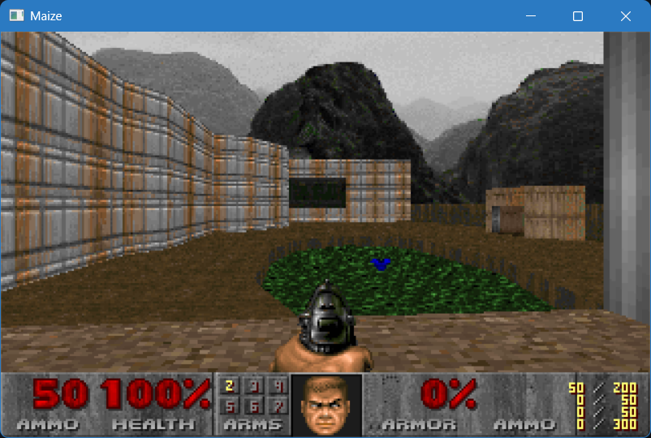

# The Maize Virtual Machine


[](https://github.com/paulmooreparks/Maize/actions/workflows/ci.yml)


[](LICENSE)

This project implements a 64-bit virtual machine called "Maize." This is an outgrowth of my [Tortilla](https://github.com/paulmooreparks/Tortilla)
project, which began life as an x86 emulator implemented in C# on .NET and then later became a virtual CPU of my own making.

Maize today is a complete toolchain: an assembler, a linker, a disassembler, and a C compiler
that targets the VM, with a small set of Unix-style system calls already implemented. The next
milestones are devices bridging the virtual environment to the host machine, a "BIOS" layer above
the virtual devices, and a simple OS; see [ROADMAP.md](ROADMAP.md) for the sequencing.

## UPDATE: Maize Runs DOOM!

As of 13 July 2026, Maize can run a version of DOOM compiled to Maize bytecode from C sources!



It's not screaming fast (it averages around 7fps on my workstation), but it's playable. Once
JIT is implemented, it should be considerably faster.

If you want to try it yourself, you just need to build a `maize` VM with display enabled and
provide your own DOOM WAD (the shareware `doom1.wad` works).

### Build a display-enabled `maize`

The SDL2 window backend is opt-in (`-DMAIZE_DISPLAY=ON`); the default build is headless and
has no SDL2 dependency. The compiled DOOM image, `demos/doom/doom.mzx`, is already in the
repo, so you only need to build the `maize` VM with the window backend, then bring a WAD.

**Windows** (PowerShell, from the repo root). SDL2 is bundled under `.toolchains/`, so there
is nothing extra to install:

``` powershell
cmake --preset windows-llvm-mingw-release -DMAIZE_DISPLAY=ON
cmake --build --preset windows-llvm-mingw-release --target maize
```

**Linux** (bash, from the repo root). Install the SDL2 development package first, then build:

``` bash
sudo apt-get install -y libsdl2-dev        # Debian/Ubuntu; use your distro's SDL2 -dev package
cmake --preset linux-release -DMAIZE_DISPLAY=ON
cmake --build --preset linux-release --target maize
```

### Run it

`maize` gives every guest a persistent sandbox root at `~/.maize/root` that IS the
guest's `/`, so the simplest way to hand DOOM its WAD is to drop the file inside it.
Make a `doom` folder under the root and put your WAD there (you supply the WAD; the
shareware `doom1.wad` or a retail `DOOM.WAD` both work):

- Windows: `%USERPROFILE%\.maize\root\doom\doom1.wad`
- Linux: `~/.maize/root/doom/doom1.wad`

The guest sees that file as `/doom/doom1.wad`. Now run, from the repo root; no
`--mount` is needed, because the WAD already lives inside the sandbox root:

``` powershell
build\windows-llvm-mingw-release\maize.exe --display --display-scale 4 --refresh-hz 20 --input=keyboard demos/doom/doom.mzx -iwad /doom/doom1.wad
```

The same run on Linux:

``` bash
build/linux-release/maize --display --display-scale 4 --refresh-hz 20 --input=keyboard demos/doom/doom.mzx -iwad /doom/doom1.wad
```

Saves just work: DOOM writes them to a relative path (`./.savegame/...`), which
resolves against the guest's `/home/user` working directory in that same persistent
sandbox root, so no writable mount is needed and your saves and config survive
across runs.

That `~/.maize` directory is also how these commands get shorter: a `~/.maize/config`
file sets default values for the launcher flags, written one `key=value` per line
with the dashes dropped (`display-scale=4`, `refresh-hz=20`, `input=keyboard`), so
you set them once instead of on every command line, and `~/.maize/env` supplies a
default guest environment. The sandbox root, the
config file, and the environment file are all explained in detail further below,
under "The sandbox root and mounting host directories", "Startup defaults
(`~/.maize/config`)", and "Setting the program's environment". (Pass `--no-root` to
opt out of the sandbox root entirely.)

For how the DOOM port itself is built and tested (the vendored doomgeneric tree, the headless
render gate, and the license-clean synthetic IWAD used by CI), see
[demos/doom/README.md](demos/doom/README.md).

## The Maize ISA Reference

**[The Maize ISA Reference (v1.0)](https://paulmooreparks.github.io/Maize/)** is the
complete, frozen instruction-set specification, published as a book. The register and
subregister model, instruction encoding, every instruction's operation and flag effects,
and the memory, trap, device-facing, and floating-point models, plus the conformance
rules. This is the authoritative reference for the machine (source under
[docs/spec/](docs/spec/README.md)).


## What It Is, Basically

* A 64-bit virtual machine implemented in C++ that executes a custom byte code
* An assembly language that represents the byte code
* An assembler (`mazm`), a linker (`mzld`), and a disassembler (`mzdis`), with a relocatable
  object format (`.mzo`) and a linked executable format (`.mzx`)
* A C compiler pipeline (`mzcc`) built on vendored [cproc](https://sr.ht/~mcf/cproc/) and
  [QBE](https://c9x.me/compile/) with a Maize code-generation target and a freestanding C runtime
* An execution environment implemented in C++ that so far runs on Windows and Linux and could easily be ported to other platforms

## Yeah, but... WHY?

It's a long story.

In 2016 I had a contract working on an ARM system, and I wasn't too familiar with ARM assembly. I had an idea to write an ARM
emulator, since I've always believed that the best way to understand a system is to try to build one. After getting stuck with the
ARM emulator, I decided to first build an x86 emulator and then go back to ARM. While I knew x86 assembly well enough to debug it,
I wasn't really an expert at it, and I didn't know the lowest levels of machine language. I thought that tackling an ISA I knew
would help me get the basics sorted out, and I'd come back to ARM later.

I got the x86 emulator working well enough to run code generated by standard compilers, but by then I wasn't working on ARM anymore, and I
was more interested in learning about how CPUs work. I also found
[Ben Eater's Youtube! channel](https://www.youtube.com/@BenEater/playlists), where he builds an 8-bit computer from scratch, and I decided
to use those as guidance for building a virtual CPU of my own design. The first implementation of that was the
[Tortilla](https://github.com/paulmooreparks/Tortilla) project.

With Tortilla, I wrote code for every single cycle of each instruction, as if the CPU were moving data around the buses like a physical CPU. That
was fun and enlightening, but it was also terribly inefficient. I decided to rewrite the entire thing in C++ and make the virtual machine more of a
byte-code execution environment rather than a simulation of a CPU, and that became the Maize project. The idea is to be able to compile any language
to Maize byte code and run it on any system that can run the Maize VM.

No, I never got back around to the ARM emulator, and at this point I doubt I will.

## Uses for Maize

Honestly, it's mainly a toy to learn about a few concepts:

* How byte-code virtual machines work
* The construction of an assembly language and corresponding assemblers and disassemblers
* Porting compiler back-ends to a new architecture
* Learning how to write an OS and BIOS for a new architecture
* Learning how systems integrate with hardware.

It's been really useful for all of the above, but what I'm most excited about is the promise of compiling any language to Maize byte code and running
it anywhere that can run the Maize VM.

## Building From Source

Maize builds with CMake + Ninja and either Clang or GCC. On Windows, the primary compiler is a pinned
llvm-mingw toolchain fetched by a small bootstrap script, no installer or admin rights
required.

The core VM and tools build from a plain checkout. The C toolchain additionally vendors
cproc and QBE as pinned git submodules, so clone with `git clone --recurse-submodules`
(or run `git submodule update --init --recursive` after a plain clone) if you want `mzcc`.
See [toolchain/VENDORING.md](toolchain/VENDORING.md) for the pins and build environments.

### Prerequisites (all platforms)

* CMake 3.21 or newer
* Ninja

Windows: `winget install Kitware.CMake` and `winget install Ninja-build.Ninja` (both
install per-user, no admin required). Linux: `sudo apt install cmake ninja-build`.
macOS: `brew install cmake ninja`.

### Windows, primary path: llvm-mingw

    scripts\bootstrap-toolchain.ps1
    cmake --preset windows-llvm-mingw-debug
    cmake --build --preset windows-llvm-mingw-debug

The bootstrap script downloads a pinned llvm-mingw release into `.toolchains\llvm-mingw\`
(gitignored) and verifies it against a pinned SHA256 checksum. Re-running it is a no-op
once the pinned version is already present.

### Windows, fallback: MSYS2 UCRT64 GCC

Install MSYS2 (msys2.org) to its default location (C:\msys64), then from an MSYS2
UCRT64 shell:

    pacman -S mingw-w64-ucrt-x86_64-toolchain

From a regular Windows shell (PowerShell or Git Bash):

    cmake --preset windows-msys2-debug
    cmake --build --preset windows-msys2-debug

If MSYS2 is installed somewhere other than C:\msys64, override the compiler paths in a
local, gitignored CMakeUserPresets.json.

### Linux (WSL or native)

    cmake --preset linux-debug
    cmake --build --preset linux-debug

Uses whichever of GCC or Clang CMake finds by default; set CC/CXX before configuring to
force a specific compiler.

### macOS

    cmake --preset macos-debug
    cmake --build --preset macos-debug

Uses the system Clang from the Xcode Command Line Tools (xcode-select --install).

### Smoke test

    mazm asm/hello.mazm
    maize asm/hello.mzb

Should print "Hello, world!". Every preset's build directory lives under build/<preset-name>/.

### Running the test suite

    scripts\run-tests.ps1        Windows
    scripts/run-tests.sh         Linux

Each script builds the four tools (maize, mazm, mzld, mzdis), then assembles and
runs every in-scope test under asm/, comparing captured output against the
expected result for each. Prints a per-test PASS/FAIL report plus a summary line.
Exits 0 if all tests pass, 1 if any test fails, 2 if the environment isn't set up
correctly (missing CMake or Ninja, or a build failure).

A separate harness, `scripts/run-ctest.sh`, compiles and runs the C corpus under
ctest/ through the full mzcc pipeline and diffs each program's output against its
committed fixture, so a codegen regression reports separately from an asm-suite
regression.

### Editor setup (VS Code)

Open the repo in VS Code, install the recommended extensions when prompted (CMake Tools
and clangd), pick a configure preset from the CMake Tools status bar, and build.
Everything above also works from any editor or a bare terminal; presets are the only
interface CMake Tools uses.

### A note on build type

All presets currently build Debug.

## How To Use Maize

Maize is implemented in standard C++ and runs on Windows and Linux. The toolchain is five tools:

* **maize** ([src/maize.cpp](src/maize.cpp)) runs a program image: a flat `.mzb` memory image
  or a linked `.mzx` executable. See "Running Maize programs directly" below for the full
  command line.
* **mazm** ([src/mazm.cpp](src/mazm.cpp)) assembles a `.mazm` source to a flat `.mzb` image,
  or to a relocatable `.mzo` object with `-c`. It reports `file:line` diagnostics, exits
  nonzero on error without leaving a stale binary, and has editor-integration modes
  (`--check`, `--stdin`); run `mazm --help` for the full flag list. The language
  and directive reference is [ASSEMBLER.md](ASSEMBLER.md).
* **mzld** ([src/mzld.cpp](src/mzld.cpp)) links `.mzo` objects into a `.mzx` executable.
  See "Object Files, Linking, and Executables" below.
* **mzdis** ([src/mzdis.cpp](src/mzdis.cpp)) disassembles a `.mzb` or `.mzx` back to
  assembly; a flat `.mzb` listing reassembles through mazm back to the exact original
  bytes, with synthesized `fn_`/`loc_` labels at call and branch targets so the listing
  reads like a normal program.
* **mzcc** compiles C11 to a runnable `.mzx` through the vendored cproc/QBE pipeline.
  See "The C Toolchain (mzcc)" below.

## Running Maize programs directly

You can register `maize` as the operating system's handler for Maize images, so
that an image runs directly the way a `.py` or `.js` file does. The full command
line is:

```
maize [options] <image> [guest-args...]
```

Options are consumed up to the first non-option token, which is `<image>`;
everything after `<image>` is passed to the program as its `argv`, verbatim (a
`-flag` after the image is a guest argument, never a maize option). `argv[0]` is
`<image>` exactly as you typed it. A `--` explicitly ends the options if you need
the image name itself to start with `-`.

`maize` loads and runs both image formats, dispatching on the header: a `.mzx`
(linked) image begins with the magic bytes `M Z X 0x01` and is loaded segment by
segment; anything else is loaded as a flat `.mzb` image at address 0. Registration
is OS-level glue on top of that, and the runner behaves as a well-formed
interpreter: it takes the image path as its first non-option argument, accepts an
absolute path, and passes any following arguments through to the guest.

### Setting the program's environment

A program's environment is built only from what you pass on the command line
plus the optional standing default file `~/.maize/env`; `maize` never inherits
your shell's own environment, so a run is deterministic.

- `-e KEY=VAL`, `--env KEY=VAL`, or `--env=KEY=VAL` adds one variable. Repeatable.
- `--env-file <path>` adds variables from a file of `KEY=VAL` lines. Blank lines
  and lines whose first non-whitespace character is `#` are ignored. Repeatable.
- `~/.maize/env` (if present) is a persistent, operator-owned default environment
  in the same `KEY=VAL` format. It is loaded into every guest first, then any
  `-e`/`--env`/`--env-file` entry appends to it (or overrides a key it defines).

`KEY` must match `[A-Za-z_][A-Za-z0-9_]*`; the value is everything after the first
`=` (it may contain further `=` characters or be empty, and there is no shell
quoting or `$`-expansion). A key defined more than once takes its last value, so a
CLI entry overrides a `~/.maize/env` default of the same key; the guest sees one
entry per key. With no env flags and no default file the program still receives a
valid, empty environment. The host environment is never inherited even with
`~/.maize/env`: that file is a standing default you control, not a leak of the
ambient host environment (the deny-by-default posture holds). It is not shipped
with any values; sensible entries an operator might add are `HOME=/home/user`,
`USER=user`, `PWD=/home/user`, `TMPDIR=/tmp`, and a `TERM`.

```sh
maize --env GREETING=hi --env TARGET=world hello.mzb alpha beta
maize --env-file run.env prog.mzb
```

### Startup defaults (`~/.maize/config`)

A long invocation collapses if you record the flag values you always use in an
optional `~/.maize/config` file. It supplies the **default** value for the scalar
and boolean launcher flags, so the precedence is built-in default < `~/.maize/config`
< CLI flag: a flag you pass on the command line always wins, and the config only
changes the value a flag starts from. The file is optional; when it is absent the
built-in defaults stand and behavior is unchanged.

The format mirrors `--env-file`: one `key=value` per line, with blank lines and
lines whose first non-whitespace character is `#` ignored. Keys are the long flag
names **without** the leading dashes:

- `display-scale` = 1..16
- `refresh-hz` = 1..1000
- `resolution` = `<width>x<height>` (e.g. `320x200`)
- `root` = host path for the sandbox root (as `--root`)
- `input` = `sys`, `keyboard`, or `console`
- `show-perf` = boolean
- `display` = boolean
- `no-root` = boolean

Booleans accept `true`/`false`, `1`/`0`, or `yes`/`no`. Parsing is fail-soft: an
unknown key or a malformed value is reported on stderr and ignored, so a bad line
never bricks the launcher. Repeatable `--mount` grants are not expressible in the
config file in v1 (a future extension); it covers the scalar and boolean flags
only.

```
# ~/.maize/config
display-scale=4
refresh-hz=20
input=keyboard
show-perf=true
```

With that file in place, `maize --display doom.mzx` behaves as if you had also
typed `--display-scale 4 --refresh-hz 20 --input=keyboard --show-perf`, and you
can still override any of them on the command line (e.g. `--display-scale 6`).

### The sandbox root and mounting host directories

By default the guest gets a persistent sandbox root filesystem: a dedicated host
directory (`~/.maize/root`, created on first run with a `/home/user` and `/tmp`
skeleton) is mounted read-write as the guest root `/`, and the startup working
directory is `/home/user`. A relative guest path resolves against that cwd, so a
program that writes `./file` (or DOOM saving to `./.savegame/...`) lands under the
sandbox root and persists across runs with no per-program configuration. Your real
filesystem is NOT reachable: only the sandbox root plus any explicit overlay grants.

Because the root is just a host directory, you can stage files into it yourself:
anything you create under `~/.maize/root` appears to the guest at the matching path.
Create `~/.maize/root/doom/` and it is the guest's `/doom/`, which is exactly how the
DOOM quickstart above hands the game its WAD (`~/.maize/root/doom/doom1.wad` becomes
`/doom/doom1.wad`) without any `--mount`.

- `--root <hostpath>` uses a different host directory as the sandbox root.
- `--no-root` disables the sandbox root; the guest starts with an empty,
  deny-by-default filesystem (only explicit `--mount` grants are reachable), the
  WASI-preopen-style capability model.

Mounts are explicit grants that overlay on top of the root (read-only unless opted
into read-write; longest guest-path prefix wins, so the root is the fallback):

- `--mount HOST=/GUEST[:ro|:rw]` grants the guest a *nix view of one host
  directory. Repeatable. `HOST` may be a native Windows path (`C:\work`,
  `C:/work`) or a POSIX path; `/GUEST` is always a *nix absolute path and cannot
  be `/` itself. `:ro` is the explicit default; `:rw` opts into writes.
- `--mount-home[=HOST]` is sugar mapping the host home directory over
  `/home/user`, read-write.

```sh
maize --mount C:/work=/proj:rw prog.mzx
maize --mount /home/paul/data=/data --mount-home prog.mzx
maize --no-root --mount /srv/data=/data:ro prog.mzx
```

Within a mount the guest uses the Linux-mirroring file syscalls (open, close,
fstat, lseek, getdents64, plus read/write on the granted fds; see the syscall
table below). Guest paths are normalized (`.`, `..`, and duplicate slashes are
resolved, `..` clamped at the root) to select the mount, and every host-side
resolution is then confined to its mount root, so `..` can never escape a mount.
Startup fails closed on a malformed or unreachable grant. The full contract,
including the binary-ABI structures, lives in
[docs/design/hostfs.md](docs/design/hostfs.md).

The scripts below are documented, user-run tools. They are **not** run by the
build, and they change OS state, so run them yourself and reverse them with the
matching `unregister` action when you are done. Both are idempotent (safe to run
twice) and fully reversible.

### Linux (binfmt_misc)

`scripts/register-binfmt.sh` registers two `binfmt_misc` entries, keyed the same
way the loader dispatches:

- `.mzx` images are matched by the header **magic** (`4D 5A 58 01`) at offset 0.
  Because the match is on magic rather than name, a magic-bearing image runs
  directly even with a different extension or no extension at all, as long as it
  has the executable bit set.
- `.mzb` images are matched by **extension**, because a flat image has no header
  magic to key on (it begins with the first instruction).

```sh
# maize must be on PATH (or pass --interp /path/to/maize). Needs root.
sudo ./scripts/register-binfmt.sh register
chmod +x hello.mzb hello.mzx
./hello.mzb        # runs via maize
./hello.mzx        # runs via maize
sudo ./scripts/register-binfmt.sh unregister   # reverses it cleanly
```

`binfmt_misc` invokes the interpreter as `maize <full-path> [args...]`, so the
image path arrives as `maize`'s first argument. The entries are per-kernel (and,
under WSL, per-instance), independent of Windows file associations.

### Windows (file associations)

`scripts/register-assoc.ps1` creates `.mzb`/`.mzx` associations under `HKCU`
(no administrator rights required, nothing machine-wide changed) pointing at
`maize.exe "%1"`:

```powershell
# maize.exe must be on PATH (or pass -MaizeExe C:\path\to\maize.exe).
pwsh ./scripts/register-assoc.ps1 register
.\hello.mzb        # runs via maize.exe (double-click in Explorer also works)
pwsh ./scripts/register-assoc.ps1 unregister   # removes the association
```

To run `prog` and have the shell find `prog.mzb`/`prog.mzx`, add `.MZB;.MZX` to
`PATHEXT`. The script prints guidance for this by default; pass `-UpdatePathext`
to append them to your user `PATHEXT` automatically (also reversed by
`unregister`).

### What works

- **Exit status works.** A directly-run image's process exit code reflects the
  program's return value (`maize` surfaces the guest's `SYS $3C` exit through its
  own exit status). A C program that ends with `return 13` yields `$?` == 13 on
  Linux (or `%ERRORLEVEL%` == 13 on Windows); codes truncate to the usual 0-255
  range.
- **Arguments and environment are delivered.** Command-line arguments after the
  image reach the guest as `argv`, and `-e/--env`/`--env-file` values reach it as
  `envp`, so a C `main(int argc, char **argv, char **envp)` sees them directly.
  When registered as an OS handler, `binfmt_misc` / the file association pass the
  invocation's trailing arguments straight through to the guest.

## Project Status

The instruction set documented below is implemented and CI-tested on Windows and Linux. The
toolchain is complete end to end: mazm assembles flat images and relocatable objects, mzld
links executables, mzdis round-trips flat images byte for byte, and mzcc compiles C11
programs that run against a small Unix-style syscall surface (read, write, exit, brk) with
real errno reporting, a brk-backed heap, and a variadic printf.

This implementation in C++ is MUCH faster and MUCH tighter than the .NET version.

The near-term road map (see [ROADMAP.md](ROADMAP.md), the sequencing source of truth):

* Introduce "devices" bridging the VM to the host machine
* Build a BIOS layer above the devices, then a simple OS with a character-mode CLI
* Implement floating-point arithmetic
* Make the assembler read Unicode source files

## Hello, World!

Here is a simple ["Hello, World!" application](https://github.com/paulmooreparks/Maize/blob/master/asm/hello.mazm)
written in Maize assembly.

    ; **********************************************************************************
    ; The entry point. Execution begins at address $00000000.

    $0000`0000:             ; The back-tick (`)  is used as a number separator.
                            ; Underscore (_) and comma (,) may also be used as separators.
        CALL main
        HALT                ; HALT halts the core pending an interrupt. With no interrupt
                            ; source in the VM, a halted core has nothing to wake it, so the
                            ; run loop returns and the Maize host process exits 0 with no
                            ; status. The status-carrying termination path is sys_exit
                            ; (SYS $3C): it records the low 8 bits of R0 as the process exit
                            ; status. A C program's crt0 routes main's return value there.

    ; **********************************************************************************
    ; The output message

    hw_string:
        STRING "Hello, world!\0"

    ; **********************************************************************************
    ; Return the length of a zero-terminated string. Equivalent to the following C code:
    ;
    ;   size_t strlen(char const *str) {
    ;       size_t len = 0;
    ;       while (str[len]) {
    ;           ++len;
    ;       }
    ;       return len;
    ;   }
    ;
    ; Maize uses a flat 64-bit address space, so pointers and the stack pointer are full
    ; 64-bit values; addresses live in whole registers, not H0 sub-registers.
    ;
    ; Parameters:
    ;   R0: Address of string
    ; Return:
    ;   RV: Length of string

    strlen:
        PUSH BP                 ; Save the caller's base pointer
        CP SP BP                ; Establish this frame: BP = SP
        SUB $08 SP              ; Reserve an 8-byte local slot for the counter
        LEA $-08 BP RT          ; RT = address of the counter (BP - 8), a full 64-bit address
        CLR R2                  ; counter = 0
        ST R2 @RT               ; Store the counter to its stack slot
    loop_condition:
        LD @RT R2               ; Load the counter
        LEA R2 R0 R1            ; R1 = string address + counter
        LD @R1 R3.B0            ; R3.B0 = the character at that address
        CMP $00 R3.B0           ; Data movement does not set flags; test the byte explicitly.
        JZ loop_exit            ; Jump out of the loop when the terminating NUL is reached.
    loop_body:
        LD @RT R2               ; Load the counter
        INC R2                  ; ...add one...
        ST R2 @RT               ; ...and store it back.
        JMP loop_condition      ; Continue the loop.
    loop_exit:
        LD @RT RV               ; Return the counter in RV.
        CP BP SP                ; Tear down the frame: SP = BP
        POP BP                  ; Restore the caller's base pointer
        RET                     ; Pop the return address from the stack into PC.

    ; **********************************************************************************
    ; The main function

    main:
        CLR R0
        CP hw_string R0.H0      ; Copy the address of the message string into R0
        CALL strlen             ; Call strlen to get the string length (into RV)
        CP $01 R0               ; $01 in R0 indicates output to stdout
        CLR R1
        CP hw_string R1.H0      ; R1 holds the address of the message to output
        CP RV R2                ; Put the string length into R2
        SYS $01                 ; Call the output function implemented in the Maize VM
        CP $00 RV               ; Set the return value for main
        RET                     ; Leave main

## Instruction Description

Numeric values are represented in Maize assembly and Maize documentation in binary, decimal, or
hexadecimal formats. The % character precedes binary-encoded values, the # character precedes
decimal-encoded values, and the $ character precedes hexadecimal-encoded values.

    %00000001   binary value
    #123        decimal value
    $FFFE1000   hexadecimal value

The underscore, back-tick (`) and comma (,) characters may all be used as numeric separators in
all encodings.

Examples:

    %0000`0001
    %1001_1100
    #123,456,789
    $0000_FFFF
    $FE,DC,BA,98
    $1234`5678
    #123,456_789`021

Instructions are variable-length encoded and may have zero, one, or two parameters. An instruction
opcode is encoded as a single eight-bit byte defining the opcode and instruction flags, and each
instruction parameter is defined in an additional byte per parameter. Immediate values are encoded
following the opcode and parameter bytes in little-endian format (least-significant bytes are
stored lower in memory).

When an instruction has two parameters, the first parameter is the source parameter, and the second
parameter is the destination parameter.

Example: Copy the immediate value $01 into register R0.

    CP $01 R0

Example: Encoding of "CP $FFCC4411 R3", which copies the immediate value $FFCC4411 into register R3.
$41 is the opcode and flags for the instruction which copies an immediate value into a register.
$02 is the parameter byte specifying a four-byte immediate value as the source parameter. $3E is
the parameter byte specifying the 64-bit register R3 as the destination parameter. The bytes
following the parameters bytes are the immediate value in little-endian format.

    $41 $02 $3E $11 $44 $CC $FF

Immediate values and register values may be used as pointers into memory, written in assembly
with a '@' prefix in front of the immediate value or register name. The '@' marks every memory
access: an operand with '@' is a memory address that gets dereferenced; an operand without '@'
is a plain value.

### CP, LD, and ST: the memory boundary

The three data-movement instructions each name exactly one operation, organized by whether they
cross the memory boundary:

* **CP** (copy) moves a value into a register: register-to-register or immediate-to-register.
  It never touches memory, so its source is never an address. Loading a constant is a CP
  (`CP $5 R0`), the same way ARM spells it `MOV #5`.
* **LD** (load) reads from a memory address into a register. Its source is always an address
  (prefixed with '@').
* **ST** (store) writes a register or immediate value to a memory address. Its destination is
  always an address (prefixed with '@').

CPZ is the zero-extending form of CP and follows the same rule. The
assembler enforces the split: `CP @...` (an address source on a copy) and `LD value` (a
non-address source on a load) are rejected with a diagnostic, so the mnemonic always tells you
whether memory is touched. The ALU instructions are separate and, Maize being CISC, may take a
memory-address operand directly (for example `ADD @R1 R0`); only CP/LD/ST/CPZ are held to
the strict split.

There is no LDZ. A load reads exactly as many bytes as the destination subregister holds (see
Copy width below), so a load never produces a value narrower than its destination and has
nothing to zero-extend. To pull an unsigned narrow value from memory into a wider register,
clear it first: `CLR R0` then `LD @addr R0.B0`.

**Copy width.** CP copies a value that may be narrower than the destination register: it
sign-extends the source to the destination's full width, and CPZ zero-extends it. `CP $01 R0`
leaves R0 = 1; `CP $FF R0` leaves R0 = 0xFFFFFFFFFFFFFFFF (the byte 0xFF read as signed -1);
`CPZ $FF R0` leaves R0 = 0x00000000000000FF. The same rule governs every immediate load,
including the ALU immediate operands, so `ADD $01 R0` adds exactly 1 rather than carrying stale
upper bytes into the operation. To write only part of a register and preserve the rest, name the
destination subregister explicitly: `CP $01 R0.B0` writes just the low byte.

A load takes its width from the destination subregister: `LD @addr R0.B0` reads one byte,
`LD @addr R0.H0` reads four, and `LD @addr R0` reads all eight. The bytes land in the named field
and the rest of the register is preserved. Because the count is fixed by the destination, a load
reads no more than it needs (it never over-reads past the source address) and never has a
narrower value to extend, which is why there is no zero-extending load.

Example: Load the 64-bit value at address $0000`1000 into register R1.

    LD @$0000`1000 R1

Example: Store the value $FF into the byte pointed at by the R0.H0 register:

    ST $FF @R0.H0

Example: Load the quarter-word located at the address stored in R3.H0 into sub-register RT.Q3:

    LD @R3.H0 RT.Q3


## Registers

Registers are 64-bits wide (a "word") and are each divided into smaller sub-registers.

    R0  General purpose
    R1  General purpose
    R2  General purpose
    R3  General purpose
    R4  General purpose
    R5  General purpose
    R6  General purpose
    R7  General purpose
    R8  General purpose
    R9  General purpose

    RT  Temporary register
    RV  Return-value register

    RF  Flag register
    RB  Base-pointer register
    RP  Program-counter register
    RS  Stack-pointer register


### Sub-registers

Sub-registers are defined as half-word (H), quarter-word (Q), and byte (B) widths. The full
64-bit value of a register (for example, register R0) may be coded as "R0" or "R0.W0". The register
value may also be accessed as separate half-word (32-bit) values, coded as R0.H1 (upper 32 bits)
and R0.H0 (lower 32-bits). The 16-bit quarter-words are similarly coded as R0.Q3, R0.Q2, R0.Q1, and
R0.Q0. Finally, the individual byte values are coded as R0.B7, R0.B6, R0.B5, R0.B4, R0.B3, R0.B2,
R0.B1, and R0.B0.

Shown graphically, the 64-bit value $FEDCBA9876543210 would be stored as follows:

     FE  DC  BA  98  76  54  32  10
    [B7][B6][B5][B4][B3][B2][B2][B0]
    [Q3    ][Q2    ][Q1    ][Q0    ]
    [H1            ][H0            ]
    [W0                            ]

In other words, if the following instruction were executed:

    CP $FEDCBA9876543210 R0

The value stored in register R0 could then be represented as follows:

    R0    = $FEDCBA9876543210
    R0.W0 = $FEDCBA9876543210
    R0.H1 = $FEDCBA98
    R0.H0 = $76543210
    R0.Q3 = $FEDC
    R0.Q2 = $BA98
    R0.Q1 = $7654
    R0.Q0 = $3210
    R0.B7 = $FE
    R0.B6 = $DC
    R0.B5 = $BA
    R0.B4 = $98
    R0.B3 = $76
    R0.B2 = $54
    R0.B1 = $32
    R0.B0 = $10


### Special-purpose Registers

Maize uses a flat 64-bit address space, so pointers, the program counter, and the stack
pointers are all full 64-bit values. There is no segmentation of the address space; segments,
where mentioned, are only a privilege/protection concept.

    RT Temporary register. Used as temporary storage within a function.

    RV Return-value register. Return values from functions are placed into this register.

    RF Flags register. FL is an alias for RF.H0, which contains the arithmetic/logic status
       flags. Flags in RF.H1 may only be set in privileged mode.

    RB Base-pointer register: the frame (base) pointer for the current function's stack frame,
       a full 64-bit address. BP is an alias for RB.

    RP Program-counter register: the full 64-bit address of the next instruction to be decoded
       and executed. PC is an alias for RP.

    RS Stack-pointer register: the full 64-bit address of the top of the stack, which grows
       downward in memory. SP is an alias for RS. The stack is full-descending: PUSH and CALL
       pre-decrement RS before writing, so RS always points at the last value pushed (or, at
       process start, one slot past the top usable slot).

There is also an instruction register, RI, which the decoder sets as it reads each instruction
and its parameters from memory. RI can only be set by the decoder and is not addressable as an
instruction operand.

#### Process start

At process start (a fresh VM invocation) Maize guarantees the following register and stack
contract. Maize is an unbounded flat 64-bit machine; there is no bounded RAM ceiling, so the
top of the stack is a chosen top-of-space constant, not a derived RAM limit.

    RS (SP)          the base of the process-start block (see below): RS points at argc. The
                     block occupies the top of the address space, ending at 0xFFFFFFFFFFFFFFF8;
                     the guest image loads at address 0, so the two never overlap. The stack is
                     full-descending, so the first guest push pre-decrements RS into the free
                     region just below the block. No stack-pointer wraparound is relied upon.
    RP (PC)          the program entry: the recorded entry point for a .mzx executable, or
                     address 0 for a flat image.
    RB (BP)          0.
    RF               the arithmetic/logic flags (RF.H0, aliased FL) are clear; the privileged
                     bit is set (execution starts privileged); interrupts are disabled; the
                     running bit is set once execution begins.
    R0..R9, RT, RV   0.

These values are a guaranteed contract, not incidental defaults: crt0 and the C calling
convention depend on a usable stack pointer and a well-formed process-start block from the
first instruction.

##### Process-start block (argc / argv / envp)

Maize places a System V-style process-start block at the top of the address space and points
RS at its base, so a C `main(int argc, char **argv, char **envp)` is always callable. There is
no ELF auxiliary vector. From RS upward, every slot is 8 bytes and little-endian (it reads back
through `LD @`):

    RS + 0                      argc
    RS + 8                      argv[0]   -> address of argv[0]'s string
    ...                         argv[argc-1]
    RS + 8 + argc*8             0         (argv NULL terminator)
    next 8                      envp[0]   -> address of envp[0]'s string
    ...                         envp[envc-1]
    ...                         0         (envp NULL terminator)
    [higher addresses]          the NUL-terminated argument and environment strings, packed in
                                order and ending at the top of the address space

`argv[i]` and `envp[j]` hold the absolute address of their NUL-terminated string. `envp` is
always present and NULL-terminated, even when there are zero environment entries, so
`main(argc, argv, envp)` is always well-formed. The C runtime's crt0 reads argc, argv, and envp
off this block into the argument registers and calls `main`; a `main(void)` simply ignores them.

### Flags

`RF.H0` (aliased as `FL`) holds the arithmetic/logic status flags. Bits are assigned as follows:

    Bit  Name  Symbol  Meaning
    0    C     Carry   Unsigned carry-out (ADD/INC) or borrow (SUB/CMP/CMPIND/DEC). For shifts,
                       the last bit shifted out. Set directly by SETCRY, cleared by CLRCRY.
    1    N     Neg     Negative: the sign bit of the result.
    2    V     Ovfl    Signed overflow: the signed result does not fit the operand width.
    3    P     Par     Parity / unordered. Set by FCMP when either operand is NaN (an unordered
                       compare); the JP / SETP predicate reads it. No integer op computes it.
    4    Z     Zero    Zero: the result is zero.
    5    -     -       Reserved (an unused sign-flag bit is declared but never read or written).
    6    -     -       Reserved.

C (unsigned carry/borrow) and V (signed overflow) are distinct flags. C uses the x86 borrow
convention: after a SUB or CMP, C is set when the destination was unsigned-less-than the source
(a borrow occurred), which is what makes JB ("below") and JA ("above") the correct unsigned
comparisons directly off a CMP. V uses the standard signed-overflow test and drives the signed
comparisons JLT ("less than") and JGT ("greater than"). Each signed/unsigned comparison also has
a complement: JGE/JLE (signed >=, <=) and JAE/JBE (unsigned >=, <=). See the conditional-branch
opcode table below (JZ/JNZ/JLT/JGT/JGE/JLE/JB/JA/JBE/JAE) for the exact branch conditions.

`RF.H1` holds the privilege, interrupt-enabled, interrupt-set, and running flags, which may only
be set in privileged mode and are unaffected by the arithmetic/logic instructions.

#### Per-instruction flag effects

    Instruction              C                       N        V                       Z
    ADD, INC                 unsigned carry-out      result   signed overflow         result == 0
    ADC                      unsigned carry-out      result   signed overflow         result == 0
    SUB, CMP, CMPIND, DEC    unsigned borrow         result   signed overflow         result == 0
    SBB                      unsigned borrow         result   signed overflow         result == 0
    MUL                      = V (mirrors overflow)  result   signed overflow         result == 0
    MULW                     high half nonzero       product  signed overflow         product == 0
    UMULW                    high half nonzero       product  = C (high half nonzero) product == 0
    DIV, MOD, UDIV, UMOD     0 (cleared)             result   0 (cleared)             result == 0
    AND, OR, XOR, NAND,      0 (cleared)             result   0 (cleared)             result == 0
      NOR, NOT, TEST, TESTIND
    SHL, SHR                 last bit shifted out    result   see below               result == 0
    SAR                      last bit shifted out    result   0 (cleared)             result == 0
    SETCRY                   1                       -        -                       -
    CLRCRY                   0                       -        -                       -
    SETcc (SETZ..SETAE)      -                       -        -                       -
    FCMP                     see below (C/Z/P set by the ordered/unordered outcome; N=V=0)

Notes:

- DIV and MOD are signed (two's-complement, truncated toward zero; the remainder takes the sign
  of the dividend). UDIV and UMOD are the unsigned counterparts. A zero divisor, and the signed
  INT_MIN / -1 quotient overflow, raise a divide-error trap (cause 2; see Trap Model); until the
  interrupt mechanism exists the VM halts with a diagnostic rather than continuing with an
  undefined result.
- MUL keeps only the low half of the product, with C mirroring its overflow flag. For the full
  double-width product and a distinct "high half nonzero" carry test, use MULW (signed) or UMULW
  (unsigned), which write the low half to dst and the high half to a second destination register.
  For MULW and UMULW, C is set when the high half is nonzero (the product spilled out of the low
  register); N is the sign bit of the whole double-width product; Z is set when the entire product
  is zero; MULW's V is the true signed-overflow test (the product does not fit the low register's
  signed range), while UMULW's V equals C.
- ADC and SBB carry the C flag into the operation: ADC computes dst + src + C, and SBB computes
  dst - src - C. A multi-word add or subtract runs ADD/SUB on the low word (which sets C) and then
  ADC/SBB on each higher word. Z reflects only the current word, so a full-width zero test ANDs the
  per-word Z results across the chain.
- Shift-count edge cases (SHL/SHR): a count of 0 leaves all flags unaffected; a count from 1 to the
  operand width shifts normally, with C set to the last bit shifted out and V defined only for a
  count of 1 (SHL: the sign bit changed; SHR: the prior sign bit); a count greater than the operand
  width yields a zero result with C, N, V all cleared and Z set. Out-of-range counts never invoke a
  C++ undefined shift.
- Shift-count edge cases (SAR): a count of 0 leaves all flags unaffected; a count from 1 to one less
  than the operand width shifts right with the sign bit replicated into the vacated high bits, C set
  to the last bit shifted out (bit n-1 of the operand) and V always 0 (an arithmetic shift replicates
  the sign bit and can never flip it, so signed overflow is impossible); a count equal to or greater
  than the operand width saturates to the sign fill, all-ones (the width's -1) for a negative operand
  or 0 for a non-negative one, with C set to the operand's sign bit, N set to the operand's sign, V
  cleared, and Z set only for a non-negative operand. This diverges from SHR, whose over-width count
  returns 0. Out-of-range counts never invoke a C++ undefined shift.
- Data movement and address computation do not affect flags. CP, LD, CPZ, ST, CLR, and
  LEA leave C/N/V/Z unchanged; only the instructions in the table above set flags. This matches
  x86 (MOV), ARM, and RISC-V, and keeps condition codes stable across register shuffling, so a
  compare and its dependent branch may be separated by data moves.
- SETcc reads flags but is flag-neutral: it writes 0 or 1 into a destination register per the
  same flag predicate the matching Jcc branch uses, and leaves C/N/V/Z (and all other RF bits)
  unchanged. It is the branchless counterpart to `CMP; Jcc`: `CMP a b` then `SETLT dst` sets dst
  to 1 when the signed comparison holds, else 0. A bare register destination writes the full W0
  (a clean 0/1 with no stale upper bits); an explicit subregister writes only that field and
  preserves the rest of the register, exactly like CLR. Each predicate is identical to its Jcc
  case so SETcc and the branch can never disagree for the same flag state:

    Mnemonic  Opcode  Condition            Predicate
    SETZ      $2B     equal / zero         Z == 1
    SETNZ     $2C     not-equal / nonzero  Z == 0
    SETLT     $2D     signed <             N != V
    SETGE     $AB     signed >=            N == V
    SETGT     $6C     signed >             Z == 0 and N == V
    SETLE     $AC     signed <=            Z == 1 or N != V
    SETB      $6B     unsigned <           C == 1
    SETAE     $EB     unsigned >=          C == 0
    SETA      $6D     unsigned >           C == 0 and Z == 0
    SETBE     $AD     unsigned <=          C == 1 or Z == 1

  For readability from a C backend or hand-written x86-idiom assembly, `mazm` also accepts the
  following synonym mnemonics; each is assembler-only sugar that emits the identical opcode as its
  canonical form above, so the two are byte-identical after assembly:

    Synonym   Canonical
    SETE      SETZ
    SETNE     SETNZ
    SETL      SETLT
    SETNGE    SETLT
    SETNL     SETGE
    SETG      SETGT
    SETNLE    SETGT
    SETNG     SETLE
    SETC      SETB
    SETNAE    SETB
    SETNC     SETAE
    SETNB     SETAE
    SETNBE    SETA
    SETNA     SETBE

## Execution

The CPU starts in privileged mode. When in privileged mode, the privilege flag is set, and
instructions marked as privileged may be executed. When the privilege flag is cleared, certain
flags, registers, and instructions are inaccessible. Program execution may return to privileged
mode via hardware interrupts or via software-generated (INT instruction) interrupts.

At process start the register and stack state is a guaranteed contract (see "Process start" under
Special-purpose Registers):

- The program counter (RP/PC) is set to the program entry: the recorded entry point for a .mzx
  executable, or address $0000,0000,0000,0000 for a flat image.
- The stack pointer (RS/SP) is set to the base of the process-start block, so RS points at
  argc (see "Process start" above). The block ends at 0xFFFFFFFFFFFFFFF8, the highest
  8-byte-aligned address in the flat 64-bit space; that address is the top of the block, not
  the initial RS. The stack grows downward: PUSH and CALL pre-decrement RS before writing, so
  the first guest push lands in the free region just below the block. No stack-pointer
  wraparound is relied upon.
- The base pointer (RB/BP) is 0, the general registers R0..R9, RT, and RV are 0, and the
  arithmetic/logic flags (RF.H0) are clear with interrupts disabled. This lets crt0 CALL into the
  program with a usable stack from the very first instruction.

Control flow: JMP targets the full 64-bit width; any sub-register selection on the operand is
ignored, and the assembler rejects a JMP operand that carries a sub-register suffix. Conditional
branches (Jcc) take an immediate target only, and encode the condition in the two high opcode bits
using the same condition scheme as the SETcc family.


## Trap Model

Every condition that is undefined behavior on a conventional machine is, on Maize, a defined
outcome: either a named **trap** with a stable numeric cause, or an explicitly defined
**non-trapping** result. There is no third category, so two conforming implementations cannot
diverge and a binary behaves identically under analysis and in production. The full normative
model (delivery, capture layout, conformance checks) lives in
[docs/spec/trap-model.md](docs/spec/trap-model.md); this section is the summary.

Traps are delivered **precisely**: the in-order core retires every prior instruction and lets no
later instruction take effect before the trap. A **fault** captures the faulting instruction's
address (so a handler can correct and retry); a **trap** captures the following instruction's
address. Synchronous traps are **unmaskable**; only external / device interrupts are maskable via
the RF interrupt-enable bit (SETINT / CLRINT). Traps and interrupts share one vector table (index =
cause number; synchronous traps low, interrupts high), one saved-state layout, and one return
instruction (IRET). With no handler installed the machine halts deterministically with the cause
surfaced.

Trap taxonomy and reserved cause / vector numbers:

    Cause  Name                                 Class  Notes
    -----  -----------------------------------  -----  -------------------------------------------------------
    0      Illegal instruction / illegal operand  Fault  Unknown opcode, unallocated condition encoding, or illegal FP encoding (subreg / width / rounding-mode / opcode form)
    1      (reserved)                             n/a    Reserved for a future debug / single-step trap
    2      Divide error                           Fault  Divide-by-zero, or signed INT_MIN / -1 quotient overflow
    3      Breakpoint (BRK)                       Trap   BRK ($FF); captures the following-instruction PC
    4      Privileged operation in user mode      Fault  Reserved number; enforcement deferred (privilege bit)
    5      Segment / bounds violation             Fault  Reserved number; mechanism ships with segments
    6      Stack fault                            Fault  Reserved number; mechanism ships with segments
    7      SYS / syscall entry                    Trap   Reserved number; SYS dispatches directly today, trap-vector delivery + ABI owned by maize-82 / maize-21
    8..31  (reserved)                             n/a    Future synchronous traps
    32..   External / device interrupts           Intr   Device / timer sources (the timer is the first)

The cause number is also the vector-table index. A cause that multiplexes conditions carries a
subcode: divide error uses 0 for divide-by-zero and 1 for quotient overflow; illegal instruction
uses 0 for an unknown opcode, 1 for an unallocated condition encoding, and 2 for an illegal FP
encoding / operand. The cause word packs the cause number in the low byte (bits 7:0), the subcode
in the next byte (bits 15:8), and the rest (bits 63:16) reserved-zero.

Explicitly defined, non-trapping behaviors (defined outcomes, not gaps in the taxonomy):

- **Integer overflow wraps** two's-complement and sets C / V per the flags model. There is no
  trap-on-overflow mode; JO / JNO and SETO / SETNO stay reserved condition encodings.
- **Out-of-range shift count is defined**: `n == 0` leaves flags unaffected; `1 <= n <= bits`
  shifts normally; `n > bits` yields result 0 with C / V / N cleared and Z set (Z = 1).
- **Unmapped / sparse memory access is defined**: a read of never-written memory returns 0; a
  write allocates a zero-filled block. No EFAULT, no page fault in the flat v1.0 model.
- **Misaligned multi-byte access is defined-allow**: stitched byte-wise across blocks, no
  alignment requirement, no trap, no vector spent.
- **Undefined immediate-size field decodes to a defined default**: immediate-size 4..7 decodes
  to the value-initialized default and does not trap. The undefined sub-register selector `$F`,
  by contrast, is a deterministic illegal-operand trap (cause 0); it is the one operand field
  that traps. (The reference VM does not yet raise the `$F` trap; a correction is tracked
  separately.)
- **Floating-point arithmetic exceptions are sticky, never trapping**: an FP invalid operation,
  divide-by-zero, overflow, underflow, or inexact result produces its IEEE-754 result (quiet NaN,
  signed infinity, correctly rounded value) and sets the corresponding sticky FCSR FFLAGS bit; the
  machine never traps on it. Only illegal FP *encodings / operands* trap (cause 0, above).


## Forward compatibility and reserved space

The v1.0 freeze holds encoding space and states contracts so that a paging MMU, atomics and
threads, base-and-bounds segments, and eventually a nommu-Linux (uClinux) port can arrive as
v1.x extensions without breaking any v1.0 binary. The full normative schedule lives in
[docs/spec/reservations.md](docs/spec/reservations.md); this is the summary. Nothing here adds
a v1.0 instruction, register, or semantic; every reserved encoding already decodes as
`reserved`.

- **Guarantee.** Every reserved extension is disabled at reset (paging off, no segment limit
  armed, machine privileged in the flat model), and extensions come only from reserved space,
  so a v1.0 binary uses no reserved encoding and nothing can collide with it.
- **Free base slots.** After the maize-122 floating-point claim of twelve base slots, four
  fully-free base slots remain: `$26`, `$28`, `$37`, `$38`. Each is earmarked to a v1.x
  claimant class (see the opcode tables below): `$26` privileged control-register access, `$28`
  paging / MMU control, `$37` SMP and memory-ordering primitives, `$38` versioning and
  capability query.
- **Escape prefix.** The full-byte-dispatch band `$3F` / `$7F` / `$BF` (`$FF` is BRK) is the
  reserved carrier for a future escape prefix that opens a second 256-entry opcode plane;
  v1.0 reserves the page but names no prefix byte and defines no second-plane content.
- **Atomics.** v1.0 baseline is single-hart sequential consistency. `CMPXCHG` (`$11`) is the
  frozen compare-and-swap: it sets the Zero flag to 1 and swaps on success, sets Zero to 0 and
  returns the observed value on failure, and leaves C / N / V unchanged. SMP ordering
  primitives (fences, acquire-release, LL-SC) are reserved at `$37`.
- **Privilege and syscalls.** The RF.H1 privilege bit gates user versus supervisor mode; `SYS`
  (`$34`) is syscall entry (trap cause 7) with the shared trap frame and `IRET` return; the
  bounds (cause 5), stack (cause 6), and a future page-fault trap class are reserved.
- **Thread pointer.** The 4-bit operand register field is full (16 of 16), so v1.0 pins **R9**
  as the thread pointer by C-ABI convention (callee-saved, never an argument, the highest
  general register) and reserves a future system-register path behind the control-register
  mechanism.
- **Control-register mechanism.** The privileged move-to / move-from control-register mechanism
  (`$26`) and its register-numbering space are reserved as the shared door for segment,
  paging, and thread-pointer state that cannot fit the operand field.


## Devices and port I/O

Maize reaches devices through a **port space** disjoint from memory: there is no MMIO, so no
device register is mapped into the memory address space and no device state is reachable via
`LD` / `ST` / `CP`. The full normative contract (the port-I/O model, external-interrupt
vectoring, and the standard device set) lives in
[docs/spec/device-surface.md](docs/spec/device-surface.md); this section is the summary. The
contract freezes existing and reserved surface and adds no v1.0 encoding; the code that
enforces it (privilege gating, the unpopulated-port outcome) is delivered by the implementing
card against this frozen contract.

- **Port space.** A flat 16-bit namespace of 65,536 ports (`$0000`..`$FFFF`), disjoint from
  memory. The port id is always the low 16 bits (`.q0`) of the port operand.
- **Instructions.** `OUT` (`$14`, immediate port), `OUTR` (`$1E`, register port), and `IN`
  (`$1F`, register or immediate port), each with the four operand forms. `IN` transfers
  device-to-register; `OUT` / `OUTR` transfer register-to-device. Each device presents an
  abstract (address, data) register pair. These three instructions are **privileged**:
  executed with the RF privilege bit clear they raise the cause-4 privileged-operation fault.
- **Unpopulated port.** A defined, non-trapping outcome: an `IN` from a port with no device
  reads 0, and an `OUT` / `OUTR` to it is discarded. This mirrors the sparse-memory no-fault
  model.
- **External interrupts.** IRQs vector through the trap model's shared table in the high range
  (vectors 32..255, 224 IRQ vectors in a 256-entry table; the vector index is the cause).
  They reuse the shared saved-state frame (aux, cause, RF, PC) and the shipped `IRET` return.
  Delivery is maskable via the RF interrupt-enable bit (`SETINT` / `CLRINT`); on delivery the
  enable bit clears and `IRET` restores it. The model is flat: a single pending source, no
  preemptive nesting, the handler runs masked until `IRET`.
- **Standard device set.** Five mandatory devices form the conformance baseline (console /
  terminal, block, timer, framebuffer, keyboard), with console and framebuffer required
  interrupt-capable. A reserved device-class / port-range convention lets future optional
  devices attach without an ISA revision.

### Standard device pinout

The standard devices occupy a reserved low-port block below `$0080`, so a natural 8-bit
immediate port operand reaches them without the immediate sign-extension that would push
the low-16-bit port id into the high range. The ratified pinout:

    Port         Device / register           R / W meaning
    ----         -------------------------   ------------------------------------------
    $00          console data                R: next input byte    W: output byte
    $01          console status              R: bit0 input-available, bit1 output-ready
    $0F          loopback (test scratch)     R/W passive round-trip register
    $10          keyboard data               R: scancode (read clears key-available)
    $11          keyboard status             R: bit0 key-available
    $20 - $22    block device                reserved (no backend yet)
    $40          timer period                W: reload value (instruction ticks)
    $41          timer control               W: bit0 enable, bit1 periodic
    $42          timer status / ack          R: bit0 tick-pending;  W: ack
    $50          framebuffer width           R: pixels (host config)
    $51          framebuffer height          R: pixels (host config)
    $52          framebuffer format          R: format id (1 = XRGB8888)
    $53          framebuffer base            R/W: guest address of the pixel buffer
    $54          framebuffer present         W: present a frame;  R: bit0 last-present-valid
    $55          framebuffer status          R: bit0 vsync-pending;  W: vsync-IRQ-enable / ack

    IRQ vectors: timer 32, console input-available 33, keyboard key-available 34,
                 block transfer-complete 35 (reserved), framebuffer vsync/refresh 36.

- **Console.** `OUT $00` emits a byte to host stdout; `IN $00` reads a byte from host
  stdin; `$01` reports output-ready and input-available; input-available raises IRQ 33. The
  built-in SYS-based terminal is unaffected and remains the default I/O path.
- **Keyboard.** Emits raw PC hardware scancodes: the Set-1 (XT) code set, with a make code
  on press and the make code with bit 7 set (`make | $80`) as the break code on release. A
  key event latches a scancode at `$10`, sets `$11` bit0, and raises IRQ 34; reading `$10`
  clears key-available. In headless runs each injected stdin byte is taken as a scancode; a
  windowed run maps host keys to Set-1 scancodes.
- **Block device.** Ports `$20`-`$22` and IRQ 35 are reserved with no backend yet; the
  storage backend, the fixed logical block size, and the filesystem land later.
- **Framebuffer.** Memory-backed, not register-per-pixel: the pixel buffer lives in
  ordinary guest RAM, written with normal `ST` / `CP` stores at full speed. This is **not**
  MMIO, the pixel memory has no device side effects, the device only reads it on present.
  The guest reads the host-configured geometry from `$50`/`$51`/`$52`, writes the guest
  address of its pixel buffer to the base register `$53`, fills the buffer with stores, and
  writes the present port `$54` to signal a completed frame; on present the device reads
  `[base, base + width*height*4)` from guest memory and displays it. The resolution is
  host-configurable with `--resolution WxH` (default 320x200); the format is XRGB8888
  (`0x00RRGGBB`, id 1). A vsync/refresh IRQ (vector 36) exists but is disabled by default.
- **Host window.** The framebuffer and keyboard drive a real host window only under the
  opt-in `--display` flag of a build compiled with the SDL2 backend enabled; the default
  build runs headless with no display dependency.


## Opcode Bytes

Opcodes are defined in an 8-bit byte separated into two flag bits and six opcode bits.

    %BBxx`xxxx  Flags bit field (bits 6 and 7)
    %xxBB`BBBB  Opcode bit field (bits 0 through 5)

When an instruction has a source parameter that may be either a register or an immediate value,
then bit 6 is interpreted as follows:

    %x0xx`xxxx  source parameter is a register
    %x1xx`xxxx  source parameter is an immediate value

When an instruction's source parameter may be either a value or a pointer to a value, then
bit 7 is interpreted as follows:

    %0xxx`xxxx  source parameter is a value
    %1xxx`xxxx  source parameter is a memory address


## Instructions

    Binary      Hex   Mnemonic  Parameters      Description
    ----------  ---   --------  ----------      --------------------------------------------------------------------------------------------------------------------------------------
    %0000`0000  $00   HALT                      Halt the clock, thereby stopping execution (privileged)

    %0000`0001  $01   CP        regVal  reg     Copy source register value into destination register with sign extension
    %0100`0001  $41   CP        immVal  reg     Copy immediate value into destination register with sign extension

    %1000`0001  $81   LD        regAddr reg     Load value at address in source register into destination register
    %1100`0001  $C1   LD        immAddr reg     Load value at immediate address into destination register

    %0000`0010  $02   ST        regVal  regAddr Store source register value at address in second register
    %0100`0010  $42   ST        immVal  regAddr Store immediate value at address in destination register

    %0000`0011  $03   ADD       regVal  reg     Add source register value to destination register
    %0100`0011  $43   ADD       immVal  reg     Add immediate value to destination register
    %1000`0011  $83   ADD       regAddr reg     Add value at address in source register to destination register
    %1100`0011  $C3   ADD       immAddr reg     Add value at immediate address to destination register

    %0000`0100  $04   SUB       regVal  reg     Subtract source register value from destination register
    %0100`0100  $44   SUB       immVal  reg     Subtract immediate value from destination register
    %1000`0100  $84   SUB       regAddr reg     Subtract value at address in source register from destination register
    %1100`0100  $C4   SUB       immAddr reg     Subtract value at immediate address from destination register

    %0000`0101  $05   MUL       regVal  reg     Multiply destination register by source register value
    %0100`0101  $45   MUL       immVal  reg     Multiply destination register by immediate value
    %1000`0101  $85   MUL       regAddr reg     Multiply destination register by value at address in source register
    %1100`0101  $C5   MUL       immAddr reg     Multiply destination register by value at immediate address

    %0000`0110  $06   DIV       regVal  reg     Signed-divide destination register by source register value
    %0100`0110  $46   DIV       immVal  reg     Signed-divide destination register by immediate value
    %1000`0110  $86   DIV       regAddr reg     Signed-divide destination register by value at address in source register
    %1100`0110  $C6   DIV       immAddr reg     Signed-divide destination register by value at immediate address

    %0000`0111  $07   MOD       regVal  reg     Signed remainder of destination register divided by source register value
    %0100`0111  $47   MOD       immVal  reg     Signed remainder of destination register divided by immediate value
    %1000`0111  $87   MOD       regAddr reg     Signed remainder of destination register divided by value at address in source register
    %1100`0111  $C7   MOD       immAddr reg     Signed remainder of destination register divided by value at immediate address

    %0000`1000  $08   AND       regVal  reg     Bitwise AND destination register with source register value
    %0100`1000  $48   AND       immVal  reg     Bitwise AND destination register with immediate value
    %1000`1000  $88   AND       regAddr reg     Bitwise AND destination register with value at address in source register
    %1100`1000  $C8   AND       immAddr reg     Bitwise AND destination register with value at immediate address

    %0000`1001  $09   OR        regVal  reg     Bitwise OR destination register with source register value
    %0100`1001  $49   OR        immVal  reg     Bitwise OR destination register with immediate value
    %1000`1001  $89   OR        regAddr reg     Bitwise OR destination register with value at address in source register
    %1100`1001  $C9   OR        immAddr reg     Bitwise OR destination register with value at immediate address

    %0000`1010  $0A   NOR       regVal  reg     Bitwise NOR destination register with source register value
    %0100`1010  $4A   NOR       immVal  reg     Bitwise NOR destination register with immediate value
    %1000`1010  $8A   NOR       regAddr reg     Bitwise NOR destination register with value at address in source register
    %1100`1010  $CA   NOR       immAddr reg     Bitwise NOR destination register with value at immediate address

    %0000`1011  $0B   NAND      regVal  reg     Bitwise NAND destination register with source register value
    %0100`1011  $4B   NAND      immVal  reg     Bitwise NAND destination register with immediate value
    %1000`1011  $8B   NAND      regAddr reg     Bitwise NAND destination register with value at address in source register
    %1100`1011  $CB   NAND      immAddr reg     Bitwise NAND destination register with value at immediate address

    %0000`1100  $0C   XOR       regVal  reg     Bitwise XOR destination register with source register value
    %0100`1100  $4C   XOR       immVal  reg     Bitwise XOR destination register with immediate value
    %1000`1100  $8C   XOR       regAddr reg     Bitwise XOR destination register with value at address in source register
    %1100`1100  $CC   XOR       immAddr reg     Bitwise XOR destination register with value at immediate address

    %0000`1101  $0D   SHL       regVal  reg     Shift value in destination register left by value in source register
    %0100`1101  $4D   SHL       immVal  reg     Shift value in destination register left by immediate value
    %1000`1101  $8D   SHL       regAddr reg     Shift value in destination register left by value at address in source register
    %1100`1101  $CD   SHL       immAddr reg     Shift value in destination register left by value at immediate address

    %0000`1110  $0E   SHR       regVal  reg     Shift value in destination register right by value in source register
    %0100`1110  $4E   SHR       immVal  reg     Shift value in destination register right by immediate value
    %1000`1110  $8E   SHR       regAddr reg     Shift value in destination register right by value at address in source register
    %1100`1110  $CE   SHR       immAddr reg     Shift value in destination register right by value at immediate address

    %0000`1111  $0F   CMP       regVal  reg     Set flags by subtracting source register value from destination register
    %0100`1111  $4F   CMP       immVal  reg     Set flags by subtracting immediate value from destination register
    %1000`1111  $8F   CMP       regAddr reg     Set flags by subtracting value at address in source register from destination register
    %1100`1111  $CF   CMP       immAddr reg     Set flags by subtracting value at immediate address from destination register

    %0001`0000  $10   TEST      regVal  reg     Set flags by ANDing source register value with destination register
    %0101`0000  $50   TEST      immVal  reg     Set flags by ANDing immediate value with destination register
    %1001`0000  $90   TEST      regAddr reg     Set flags by ANDing value at address in source register with destination register
    %1101`0000  $D0   TEST      immAddr reg     Set flags by ANDing value at immediate address with destination register

    %0001`0001  $11   CMPXCHG   regVal  reg reg Compare value in operand 2 with value in operand 3. If equal, set zero flag and copy value in operand 1 register into operand 2. Otherwise, clear zero flag and copy value in operand 2 into operand 3.
    %0101`0001  $51   CMPXCHG   immVal  reg reg Compare value in operand 2 with value in operand 3. If equal, set zero flag and copy value in operand 1 immediate value into operand 2. Otherwise, clear zero flag and copy value in operand 2 into operand 3.
    %1001`0001  $91   CMPXCHG   regAddr reg reg Compare value in operand 2 with value in operand 3. If equal, set zero flag and load value at address in operand 1 register into operand 2. Otherwise, clear zero flag and load value in operand 2 into operand 3.
    %1101`0001  $D1   CMPXCHG   immAddr reg reg Compare value in operand 2 with value in operand 3. If equal, set zero flag and load value at address in operand 1 immediate value into operand 2. Otherwise, clear zero flag and load value in operand 2 into operand 3.

    %0001`0010  $12   LEA       regVal  reg reg Add register value in operand 1 to value in operand 2 register and store result in operand 3 register
    %0101`0010  $52   LEA       immVal  reg reg Add immediate value in operand 1 to value in operand 2 register and store result in operand 3 register
    %1001`0010  $92   LEA       regAddr reg reg Add value at address in operand 1 register to value in operand 2 register and store result in operand 3 register
    %1101`0010  $D2   LEA       immAddr reg reg Add value at immediate address in operand 1 to value in operand 2 register and store result in operand 3 register

    %0001`0011  $13   CPZ       regVal  reg     Copy source register value into destination register with zero extension
    %0101`0011  $53   CPZ       immVal  reg     Copy immediate value into destination register with zero extension

    %1001`0011  $93                             reserved
    %1101`0011  $D3                             reserved

    %0001`0100  $14   OUT       regVal  imm     Output value in source register to destination port (privileged)
    %0101`0100  $54   OUT       immVal  imm     Output immediate value to destination port (privileged)
    %1001`0100  $94   OUT       regAddr imm     Output value at address in source register to destination port (privileged)
    %1101`0100  $D4   OUT       immAddr imm     Output value at immediate address to destination port (privileged)

    %0001`0101  $15   FGETCSR   reg             Copy the FP control/status register (FCSR: FRM + FFLAGS) into the operand register
    %0101`0101  $55   FSETCSR   reg             Copy the operand register (low 8 bits) into FCSR; also clears the sticky FFLAGS
    %1001`0101  $95                             reserved
    %1101`0101  $D5                             reserved

    %0001`0110  $16   JMP       regVal          Jump to address in source register and continue execution
    %0101`0110  $56   JMP       immVal          Jump to immediate address and continue execution
    %1001`0110  $96   JMP       regAddr         Jump to address pointed to by source register and continue execution
    %1101`0110  $D6   JMP       immAddr         Jump to address pointed to by immediate value and continue execution

    %0001`0111  $17   JZ        immVal          If Zero flag is set, jump to the immediate address
    %0101`0111  $57   JB        immVal          If Carry flag is set (unsigned <), jump to the immediate address
    %1001`0111  $97   JGE       immVal          If Negative flag equals Overflow flag (signed >=), jump to the immediate address
    %1101`0111  $D7   JAE       immVal          If Carry flag is clear (unsigned >=), jump to the immediate address

    %0001`1000  $18   JNZ       immVal          If Zero flag is clear, jump to the immediate address
    %0101`1000  $58   JGT       immVal          If Zero flag is clear and Negative flag equals Overflow flag (signed >), jump to the immediate address
    %1001`1000  $98   JLE       immVal          If Zero flag is set or Negative flag differs from Overflow flag (signed <=), jump to the immediate address
    %1101`1000  $D8   JP        immVal          If Parity flag is set (FCMP unordered / NaN operand), jump to the immediate address

    %0001`1001  $19   JLT       immVal          If Negative flag differs from Overflow flag (signed <), jump to the immediate address
    %0101`1001  $59   JA        immVal          If Carry flag is clear and Zero flag is clear (unsigned >), jump to the immediate address
    %1001`1001  $99   JBE       immVal          If Carry flag is set or Zero flag is set (unsigned <=), jump to the immediate address
    %1101`1001  $D9                             reserved

    %0001`1010  $1A   FADD      regVal  reg     FP add source register value to destination register (width from destination subregister: H0/H1 = binary32, W0 = binary64)
    %0101`1010  $5A   FADD      immVal  reg     FP add immediate value (raw IEEE-754 bits) to destination register
    %1001`1010  $9A   FADD      regAddr reg     FP add value at address in source register to destination register
    %1101`1010  $DA   FADD      immAddr reg     FP add value at immediate address to destination register

    %0001`1011  $1B   FSUB      regVal  reg     FP subtract source register value from destination register
    %0101`1011  $5B   FSUB      immVal  reg     FP subtract immediate value from destination register
    %1001`1011  $9B   FSUB      regAddr reg     FP subtract value at address in source register from destination register
    %1101`1011  $DB   FSUB      immAddr reg     FP subtract value at immediate address from destination register

    %0001`1100  $1C   FMUL      regVal  reg     FP multiply destination register by source register value
    %0101`1100  $5C   FMUL      immVal  reg     FP multiply destination register by immediate value
    %1001`1100  $9C   FMUL      regAddr reg     FP multiply destination register by value at address in source register
    %1101`1100  $DC   FMUL      immAddr reg     FP multiply destination register by value at immediate address

    %0001`1101  $1D   CALL      regVal          Push the return address to the stack, jump to address in source register and continue execution until RET is executed
    %0101`1101  $5D   CALL      immVal          Push the return address to the stack, jump to immediate address and continue execution until RET is executed
    %1001`1101  $9D   CALL      regAddr         Push the return address to the stack, jump to address pointed to by source register and continue execution until RET is executed
    %1101`1101  $DD   CALL      immAddr         Push the return address to the stack, jump to address pointed to by immediate value and continue execution until RET is executed

    %0001`1110  $1E   OUTR      regVal  reg     Output value in source register to port in destination register (privileged)
    %0101`1110  $5E   OUTR      immVal  reg     Output immediate value to port in destination register (privileged)
    %1001`1110  $9E   OUTR      regAddr reg     Output value at address in source register to port in destination register (privileged)
    %1101`1110  $DE   OUTR      immAddr reg     Output value at immediate address to port in destination register (privileged)

    %0001`1111  $1F   IN        regVal  reg     Read value from port in source register into destination register (privileged)
    %0101`1111  $5F   IN        immVal  reg     Read value from port in immediate value into destination register (privileged)
    %1001`1111  $9F   IN        regAddr reg     Read value from port at address in source register into destination register (privileged)
    %1101`1111  $DF   IN        immAddr reg     Read value from port at immediate address into destination register (privileged)

    %0010`0000  $20   PUSH      regVal          Copy register value into memory at the stack pointer (SP), decrement SP by size of register
    %0110`0000  $60   PUSH      immVal          Copy immediate value into memory at the stack pointer (SP), decrement SP by size of immediate value

    %0010`0001  $21   FDIV      regVal  reg     FP divide destination register by source register value
    %0110`0001  $61   FDIV      immVal  reg     FP divide destination register by immediate value
    %1010`0001  $A1   FDIV      regAddr reg     FP divide destination register by value at address in source register
    %1110`0001  $E1   FDIV      immAddr reg     FP divide destination register by value at immediate address

    %0010`0010  $22   FSQRT     reg     reg     FP square root of source register into destination register (row 0)
    %0110`0010  $62   FNEG      reg     reg     FP negate (sign-bit flip, exact, no flags) source register into destination register (row 1)
    %1010`0010  $A2   FABS      reg     reg     FP absolute value (sign-bit clear, exact, no flags) source register into destination register (row 2)
    %1110`0010  $E2                             reserved (FSQRT/FNEG/FABS slot, row 3)

    %0010`0011  $23   FMADD     regVal  reg reg FP fused multiply-add, single-rounded: operand-3 register = operand-1 * operand-2 + operand-3
    %0110`0011  $63   FMADD     immVal  reg reg FP fused multiply-add: operand-3 = immediate * operand-2 + operand-3
    %1010`0011  $A3   FMADD     regAddr reg reg FP fused multiply-add: operand-3 = (value at address in operand 1) * operand-2 + operand-3
    %1110`0011  $E3   FMADD     immAddr reg reg FP fused multiply-add: operand-3 = (value at immediate address) * operand-2 + operand-3

    %0010`0101  $25   FMSUB     regVal  reg reg FP fused multiply-subtract, single-rounded: operand-3 register = operand-1 * operand-2 - operand-3
    %0110`0101  $65   FMSUB     immVal  reg reg FP fused multiply-subtract: operand-3 = immediate * operand-2 - operand-3
    %1010`0101  $A5   FMSUB     regAddr reg reg FP fused multiply-subtract: operand-3 = (value at address in operand 1) * operand-2 - operand-3
    %1110`0101  $E5   FMSUB     immAddr reg reg FP fused multiply-subtract: operand-3 = (value at immediate address) * operand-2 - operand-3

    %0010`1010  $2A   FCMP      regVal  reg     FP quiet compare: set integer flags C/Z/P by comparing destination register against source register value (unordered -> C=Z=P=1)
    %0110`1010  $6A   FCMP      immVal  reg     FP quiet compare against immediate value
    %1010`1010  $AA   FCMP      regAddr reg     FP quiet compare against value at address in source register
    %1110`1010  $EA   FCMP      immAddr reg     FP quiet compare against value at immediate address

    %0010`0100  $24   INT       regVal          Push FL and PC to stack and generate a software interrupt at index stored in register (privileged)
    %0110`0100  $64   INT       immVal          Push FL and PC to stack and generate a software interrupt using immediate index (privileged)

    %0010`0110  $26                             reserved (v1.x privileged control-register access; see docs/spec/reservations.md)

    %0010`0111  $27   RET                       Pop the return address from the stack and continue execution at that address. Used to return from CALL.
    %0110`0111  $67   IRET                      Pop FL and PC from the stack and continue execution at the address in PC. Used to return from interrupt (privileged).
    %1010`0111  $A7   NOP                       No operation. Used as an instruction placeholder.
    %1110`0111  $E7                             reserved

    %0010`1000  $28                             reserved (v1.x paging / MMU control; see docs/spec/reservations.md)

    %0010`1001  $29   SETINT                    Set the Interrupt flag, thereby enabling hardware interrupts (privileged)
    %0110`1001  $69   CLRINT                    Clear the Interrupt flag, thereby disabling hardware interrupts (privileged)
    %1010`1001  $A9   SETCRY                    Set the Carry flag
    %1110`1001  $E9   CLRCRY                    Clear the Carry flag

    %0010`1011  $2B   SETZ      regVal          Set destination register to 1 if Zero flag is set, else 0 (reads flags; flag-neutral)
    %0110`1011  $6B   SETB      regVal          Set destination register to 1 if Carry flag is set (unsigned <), else 0 (reads flags; flag-neutral)
    %1010`1011  $AB   SETGE     regVal          Set destination register to 1 if Negative flag equals Overflow flag (signed >=), else 0 (reads flags; flag-neutral)
    %1110`1011  $EB   SETAE     regVal          Set destination register to 1 if Carry flag is clear (unsigned >=), else 0 (reads flags; flag-neutral)

    %0010`1100  $2C   SETNZ     regVal          Set destination register to 1 if Zero flag is clear, else 0 (reads flags; flag-neutral)
    %0110`1100  $6C   SETGT     regVal          Set destination register to 1 if Zero flag is clear and Negative flag equals Overflow flag (signed >), else 0 (reads flags; flag-neutral)
    %1010`1100  $AC   SETLE     regVal          Set destination register to 1 if Zero flag is set or Negative flag differs from Overflow flag (signed <=), else 0 (reads flags; flag-neutral)
    %1110`1100  $EC   SETP      regVal          Set destination register to 1 if Parity flag is set (FCMP unordered / NaN operand), else 0 (reads flags; flag-neutral)

    %0010`1101  $2D   SETLT     regVal          Set destination register to 1 if Negative flag differs from Overflow flag (signed <), else 0 (reads flags; flag-neutral)
    %0110`1101  $6D   SETA      regVal          Set destination register to 1 if Carry flag is clear and Zero flag is clear (unsigned >), else 0 (reads flags; flag-neutral)
    %1010`1101  $AD   SETBE     regVal          Set destination register to 1 if Carry flag is set or Zero flag is set (unsigned <=), else 0 (reads flags; flag-neutral)
    %1110`1101  $ED                             reserved

    %0010`1110  $2E   SAR       regVal  reg     Arithmetic-shift value in destination register right by value in source register
    %0110`1110  $6E   SAR       immVal  reg     Arithmetic-shift value in destination register right by immediate value
    %1010`1110  $AE   SAR       regAddr reg     Arithmetic-shift value in destination register right by value at address in source register
    %1110`1110  $EE   SAR       immAddr reg     Arithmetic-shift value in destination register right by value at immediate address

    %0011`0101  $35   UDIV      regVal  reg     Unsigned-divide destination register by source register value
    %0111`0101  $75   UDIV      immVal  reg     Unsigned-divide destination register by immediate value
    %1011`0101  $B5   UDIV      regAddr reg     Unsigned-divide destination register by value at address in source register
    %1111`0101  $F5   UDIV      immAddr reg     Unsigned-divide destination register by value at immediate address

    %0011`0110  $36   UMOD      regVal  reg     Unsigned remainder of destination register divided by source register value
    %0111`0110  $76   UMOD      immVal  reg     Unsigned remainder of destination register divided by immediate value
    %1011`0110  $B6   UMOD      regAddr reg     Unsigned remainder of destination register divided by value at address in source register
    %1111`0110  $F6   UMOD      immAddr reg     Unsigned remainder of destination register divided by value at immediate address

    %0011`0111  $37                             reserved (v1.x SMP / memory-ordering primitives; see docs/spec/reservations.md)

    %0011`1000  $38                             reserved (v1.x versioning / capability query; see docs/spec/reservations.md)

    %0011`1001  $39   FCVTFF    reg     reg     FP convert float to float between binary32 and binary64 (widths from the two subregisters); rounds per FRM (row 0)
    %0111`1001  $79   FCVTFS    reg     reg     FP convert float to signed integer (saturating; NaN/overflow -> NV); rounds per FRM (row 1)
    %1011`1001  $B9   FCVTFU    reg     reg     FP convert float to unsigned integer (saturating; NaN/overflow -> NV); rounds per FRM (row 2)
    %1111`1001  $F9                             reserved (FCVTFF/FCVTFS/FCVTFU slot, row 3)

    %0011`1010  $3A   FCVTSF    reg     reg     FP convert signed integer to float; rounds per FRM (row 0)
    %0111`1010  $7A   FCVTUF    reg     reg     FP convert unsigned integer to float; rounds per FRM (row 1)
    %1011`1010  $BA                             reserved (FCVTSF/FCVTUF slot, row 2)
    %1111`1010  $FA                             reserved (FCVTSF/FCVTUF slot, row 3)

    %0011`1011  $3B   ADC       regVal  reg     Add source register value plus Carry to destination register
    %0111`1011  $7B   ADC       immVal  reg     Add immediate value plus Carry to destination register
    %1011`1011  $BB   ADC       regAddr reg     Add value at address in source register plus Carry to destination register
    %1111`1011  $FB   ADC       immAddr reg     Add value at immediate address plus Carry to destination register

    %0011`1100  $3C   SBB       regVal  reg     Subtract source register value plus Carry (borrow) from destination register
    %0111`1100  $7C   SBB       immVal  reg     Subtract immediate value plus Carry (borrow) from destination register
    %1011`1100  $BC   SBB       regAddr reg     Subtract value at address in source register plus Carry (borrow) from destination register
    %1111`1100  $FC   SBB       immAddr reg     Subtract value at immediate address plus Carry (borrow) from destination register

    %0011`1101  $3D   MULW      regVal  reg reg Signed wide multiply: full product of operand 2 by source register value; low half to operand 2, high half to operand 3
    %0111`1101  $7D   MULW      immVal  reg reg Signed wide multiply: full product of operand 2 by immediate value; low half to operand 2, high half to operand 3
    %1011`1101  $BD   MULW      regAddr reg reg Signed wide multiply: full product of operand 2 by value at address in source register; low half to operand 2, high half to operand 3
    %1111`1101  $FD   MULW      immAddr reg reg Signed wide multiply: full product of operand 2 by value at immediate address; low half to operand 2, high half to operand 3

    %0011`1110  $3E   UMULW     regVal  reg reg Unsigned wide multiply: full product of operand 2 by source register value; low half to operand 2, high half to operand 3
    %0111`1110  $7E   UMULW     immVal  reg reg Unsigned wide multiply: full product of operand 2 by immediate value; low half to operand 2, high half to operand 3
    %1011`1110  $BE   UMULW     regAddr reg reg Unsigned wide multiply: full product of operand 2 by value at address in source register; low half to operand 2, high half to operand 3
    %1111`1110  $FE   UMULW     immAddr reg reg Unsigned wide multiply: full product of operand 2 by value at immediate address; low half to operand 2, high half to operand 3

    %0010`1111  $2F   CMPIND    regVal regAddr  Set flags by subtracting source register value from value at address in destination register
    %0110`1111  $6F   CMPIND    immVal regAddr  Set flags by subtracting immediate value from value at address in destination register

    %0011`0000  $30   TSTIND    regVal regAddr  Set flags by ANDing source register value with value at address in destination register
    %0111`0000  $70   TSTIND    immVal regAddr  Set flags by ANDing immediate value with value at address in destination register

    %0011`0001  $31   INC       regVal          Increment register by 1.
    %0111`0001  $71   DEC       regVal          Decrement register by 1.
    %1011`0001  $B1   NOT       regVal          Bitwise negate (one's complement) value in register, store result in register.
    %1111`0001  $F1   NEG       regVal          Two's-complement negate (0 - value) in register, with SUB-family flags (C set when the value is non-zero; V set only for the width's most-negative value).

    %0011`0010  $32   CLR       regVal          Set register to zero (0).
    %0111`0010  $72   POP       regVal          Increment SP by size of register, copy value at SP into register

    %0011`0011  $33   FMIN      reg     reg     FP minimum of destination and source registers (RISC-V NaN/signed-zero rules; sNaN -> NV) (row 0)
    %0111`0011  $73   FMAX      reg     reg     FP maximum of destination and source registers (RISC-V NaN/signed-zero rules; sNaN -> NV) (row 1)
    %1011`0011  $B3                             reserved (FMIN/FMAX slot, row 2)
    %1111`0011  $F3                             reserved (FMIN/FMAX slot, row 3)

    %0011`0100  $34   SYS       regVal          Execute a system call using the system-call index stored in register
    %0111`0100  $74   SYS       immVal          Execute a system call using the immediate index

    %1110`0000  $E0   XCHG      reg     reg     Atomically exchange the values in two registers

    %1110`0100  $E4                             reserved

    %1111`1111  $FF   BRK                       Breakpoint trap (cause 3; captures following-instruction PC; see Trap Model)


## Floating-Point (IEEE-754)

Maize implements IEEE-754-2019 **binary32** (single) and **binary64** (double), both
widths, all five rounding modes, all five sticky exception flags, subnormals (gradual
underflow, no flush-to-zero), and a fused multiply-add. Semantics track the RISC-V F/D
extensions closely, with one deliberate divergence named below (a NaN float->integer
conversion yields 0 rather than RISC-V's maximum value); conformance is the standard
IEEE-754 vectors, not per-op reasoning.

### Zfinx: floats live in the integer registers

FP is **Zfinx-style**: floating-point instructions read operands from and write results
to the existing sixteen integer registers. There is no separate FP register bank and no
FP load/store/move (`LD`/`ST`/`CP` already move the bits). Format width comes from the
per-operand **subregister field**, exactly as for integer ops:

- **binary32** occupies a 32-bit subregister view: `H0` or `H1`.
- **binary64** occupies the full 64-bit register: `W0`.

A `B*` or `Q*` subregister on a floating-point operand is illegal: mazm rejects it at
assemble time, and the VM raises a deterministic illegal-operand trap. There is **no
NaN-boxing**: a binary32 value simply occupies a 32-bit subregister like any 32-bit
integer, and the upper bits follow the existing subregister merge semantics.

The float operands of a same-format op (FADD/FSUB/FMUL/FDIV/FCMP, FSQRT/FNEG/FABS,
FMIN/FMAX, and FMADD/FMSUB) must all be the **same width**: mixing a binary32 and a
binary64 operand (for example `FADD R0.H0 R1.W0`) is a deterministic illegal-operand
trap, and mazm rejects it at assemble time. An FP immediate source must likewise be
exactly the destination float width (4 bytes for binary32, 8 for binary64). The
conversion ops (FCVTFF and the integer/float FCVT* family) are the sole exception, since
a conversion names two operands of intentionally different width.

### FCSR: rounding mode and sticky exception flags

A dedicated architectural **FP control/status register (FCSR)** holds the rounding mode
and the sticky exception flags, keeping the hot per-instruction integer flags C/N/V/Z
uncontaminated. It is not one of the sixteen operand-addressable registers; software
reads and writes it with `FGETCSR reg` and `FSETCSR reg`. The byte layout is RISC-V's
`fcsr` verbatim:

    Bits 7-5  FRM     rounding mode (3 bits)
    Bits 4-0  FFLAGS  sticky exception flags (5 bits)

`FSETCSR` writes the low 8 bits and thereby also clears the sticky flags (flags are set
by hardware, cleared only by software). Reset default is `0x00` (RNE, no flags). The
upper bits are reserved for a future v1.x trap-enable extension and are not implemented.

**FRM (rounding mode)**, RISC-V encoding:

    000  RNE  round to nearest, ties to even (default)
    001  RTZ  round toward zero
    010  RDN  round toward -infinity
    011  RUP  round toward +infinity
    100  RMM  round to nearest, ties to max magnitude
    101, 110  reserved
    111  DYN  not supported (Maize has no per-instruction rounding field)

Every rounding op consults the current FRM; there is no per-instruction rounding field.
A rounding op executed while FRM holds a reserved encoding (`101`/`110`) or the
unsupported `DYN` (`111`) is a deterministic illegal-operand trap, not a silent
round-to-nearest (matching RISC-V, which treats a reserved static rounding mode as
illegal). The non-rounding ops (FNEG, FABS, FMIN, FMAX, FCMP) never consult FRM and are
unaffected.

**FFLAGS (sticky exception flags)**, RISC-V bit order:

    bit 4  NV  invalid operation (sNaN operand, 0*inf, inf-inf, 0/0, inf/inf,
               sqrt of a negative, invalid float->int conversion)
    bit 3  DZ  divide by zero (finite nonzero / 0)
    bit 2  OF  overflow (rounded result exceeds the largest finite value)
    bit 1  UF  underflow (a tiny nonzero result)
    bit 0  NX  inexact (the result is not exactly representable)

These are the 754 arithmetic exceptions and are distinct from the integer RF flags; in
particular FFLAGS.OF (binary overflow to infinity) is not RF.V (integer signed overflow).

### Exceptions are sticky, not trapping (v1.0)

FP arithmetic exceptions do **not** trap in v1.0. A divide by zero yields the correctly
signed infinity and sets DZ; an invalid operation yields the canonical qNaN and sets NV;
the operation always produces its 754-defined result. Only **illegal encodings** trap (a
`B*`/`Q*` subregister on an FP operand, or a reserved/unallocated FP opcode form), as part
of the illegal-instruction taxonomy. Trapping FP (754 alternate exception handling) is a
reserved future extension in the unused FCSR bits.

### NaN handling

A signaling NaN has the significand MSB clear; a quiet NaN has it set. A signaling-NaN
operand to any arithmetic op, to FMIN/FMAX, or to FCMP raises NV; a quiet NaN does not.
Every NaN-producing arithmetic op returns the **canonical qNaN** (binary32 `0x7FC00000`,
binary64 `0x7FF8000000000000`; positive, quiet, zero payload) rather than preserving an
input payload, matching RISC-V. FNEG and FABS are the sole exceptions: they manipulate the
sign bit only, raise no flags, do not round, and pass NaN payloads through unchanged.

### FCMP and the float branch idioms

`FCMP src, a` compares the destination register `a` against the source `src` and writes
the integer flags, mapping the four 754 outcomes onto the x86 `UCOMISD` convention:

    Outcome              C (bit0)  Z (bit4)  P (bit3)  N,V
    a > src (ordered)    0         0         0         0,0
    a < src (ordered)    1         0         0         0,0
    a == src             0         1         0         0,0
    unordered (a NaN)    1         1         1         0,0

FCMP is the **quiet** compare: a quiet-NaN operand yields unordered without signaling;
only a signaling NaN raises NV. After FCMP the ordered branch idioms work directly off
the reused predicate table:

    JB  / SETB   a < src        JA  / SETA   a > src
    JBE          a <= src       JAE          a >= src
    JZ  / SETZ   a == src       JP  / SETP   unordered (either operand NaN)

`JP` / `SETP` is the new unordered predicate; `JNP` / `SETNP` are synthesized by branch
inversion (there is no separate opcode).

### Operations

- **Arithmetic** (`FADD`, `FSUB`, `FMUL`, `FDIV`): correctly rounded under the current FRM,
  full four addressing-mode source forms like the integer ALU. `FADD src dst` computes
  `dst = dst + src`.
- **Unary** (`FSQRT`, `FNEG`, `FABS`): register-only, `MNEMONIC src dst` computing
  `dst = f(src)`. FSQRT is correctly rounded; FNEG/FABS are exact sign-bit ops.
- **Fused multiply-add** (`FMADD`, `FMSUB`): three registers, single-rounded
  `dst = a*b (+/-) c` where the third operand is both the addend `c` and the destination.
  `FNMADD` = `FNEG(FMADD(...))` and `FNMSUB` = `FNEG(FMSUB(...))` are synthesized via the
  exact FNEG (no dedicated opcode), so they remain single-rounded.
- **Min / max** (`FMIN`, `FMAX`): RISC-V semantics. A quiet-NaN operand returns the non-NaN
  operand; both NaN returns the canonical qNaN; a signaling NaN raises NV; `-0 < +0`.
- **Compare** (`FCMP`): the quiet compare above.
- **Conversions**: `FCVTFF` (float <-> float, widths from the two subregisters), `FCVTFS` /
  `FCVTFU` (float -> signed / unsigned integer, saturating: overflow -> max, underflow ->
  min, all setting NV), `FCVTSF` / `FCVTUF` (signed / unsigned integer -> float). All round
  per FRM. Note one **deliberate divergence from RISC-V**: a NaN input to a float->integer
  conversion yields **0** here (matching the common C-cast convention), whereas RISC-V
  yields the maximum-magnitude value; both set NV. This is the only point where Maize's
  float->int conversion departs from the RISC-V F/D behavior it otherwise mirrors.

### Synthesizing FCLASS / copysign (no dedicated opcode)

Maize deliberately spends no opcode on FCLASS or FSGNJ (copysign); under Zfinx these are
integer bit-operations on the register that already holds the float:

- **isnan(x)**: `FCMP x, x` then `JP` (a value compares unordered with itself iff it is NaN).
- **copysign(x, y)**: clear x's sign with `AND` against `0x7FFF...`, extract y's sign with
  `AND` against `0x8000...`, then `OR` the two.
- **isinf / isfinite / fpclassify**: mask the exponent and mantissa fields with `AND` and
  compare the bit patterns; the exponent-all-ones / mantissa-zero test distinguishes
  infinity from NaN.

### Implementation note (RMM)

The VM computes on the host FPU (IEEE-754 conformant), setting the hardware rounding
direction from FRM and reading the hardware exception flags into FFLAGS, with `std::fma`
for the fused multiply-add. The four directed rounding modes (RNE/RTZ/RDN/RUP) map onto
the hardware directions and are correctly rounded by the host FPU. RMM
(ties-to-max-magnitude), which no hardware direction provides, is synthesized by computing
the operation in a wider host type and rounding the result to the target width with an
explicit ties-away rule; its flags come from the equivalent nearest evaluation, which
shares RMM's exception conditions and overflow threshold.

RMM carries a small set of documented limitations, all confined to exact-tie behavior and
none affecting the four hardware rounding modes:

- The wider-type path is exact for binary32 add/sub/mul (double is exact) and for binary64
  add/sub/mul on a host with an 80-bit `long double`. The RMM tie decision for div, sqrt,
  and FMA inherits a benign double-rounding edge (the wider result is itself a rounding),
  which a focused conformance fixture does not exercise.
- A binary64 FMA under RMM at an exact tie falls back to the nearest-even value, because
  re-rounding a 106-bit product exceeds the 80-bit host `long double`.

RMM's directed sibling modes and every mode of the other ops are unaffected.


## Register Parameter

### Register bit field

    %0000`xxxx  $0   R0 register
    %0001`xxxx  $1   R1 register
    %0010`xxxx  $2   R2 register
    %0011`xxxx  $3   R3 register
    %0100`xxxx  $4   R4 register
    %0101`xxxx  $5   R5 register
    %0110`xxxx  $6   R6 register
    %0111`xxxx  $7   R7 register
    %1000`xxxx  $8   R8 register
    %1001`xxxx  $9   R9 register
    %1010`xxxx  $A   RT register
    %1011`xxxx  $B   RV register
    %1100`xxxx  $C   RF register (flags)
    %1101`xxxx  $D   RB register (base pointer)
    %1110`xxxx  $E   RP register (program counter)
    %1111`xxxx  $F   RS register (stack pointer)

### Sub-register bit field

    %xxxx`0000  $0   X.B0 (1-byte data)
    %xxxx`0001  $1   X.B1 (1-byte data)
    %xxxx`0010  $2   X.B2 (1-byte data)
    %xxxx`0011  $3   X.B3 (1-byte data)
    %xxxx`0100  $4   X.B4 (1-byte data)
    %xxxx`0101  $5   X.B5 (1-byte data)
    %xxxx`0110  $6   X.B6 (1-byte data)
    %xxxx`0111  $7   X.B7 (1-byte data)
    %xxxx`1000  $8   X.Q0 (2-byte data)
    %xxxx`1001  $9   X.Q1 (2-byte data)
    %xxxx`1010  $A   X.Q2 (2-byte data)
    %xxxx`1011  $B   X.Q3 (2-byte data)
    %xxxx`1100  $C   X.H0 (4-byte data)
    %xxxx`1101  $D   X.H1 (4-byte data)
    %xxxx`1110  $E   X    (8-byte data)


## Immediate Parameter

### Immediate Value Bit Field

    %xxxx`x000  $x0  instruction reads 1 byte immediate (8 bits)
    %xxxx`x001  $x1  instruction reads 2-byte immediate (16 bits)
    %xxxx`x010  $x2  instruction reads 4-byte immediate (32 bits)
    %xxxx`x011  $x3  instruction reads 8-byte immediate (64 bits)

Bits 0-2 select the immediate width. Bit 3 and bits 4-7 are reserved
(must be zero) and carry no operation. A previously documented
immediate math-operation mode was never implemented and has been
withdrawn from the encoding; the bits remain reserved for possible
future use.


## BIOS Interface

BIOS calls will track as closely as possible to the "standard" BIOS routines found on typical
x86 PCs. The x86 registers used in BIOS calls will map to Maize registers as follows:

    AX -> R0.Q0
       AL -> R0.B0
       AH -> R0.B1
    BX -> R0.Q1
       BL -> R0.B2
       BH -> R0.B3
    CX -> R0.Q2
       CL -> R0.B4
       CH -> R0.B5
    DX -> R0.Q3
       DL -> R0.B6
       DH -> R0.B7


## OS ABI

The C calling convention, implemented by the QBE Maize target and documented authoritatively
in [toolchain/qbe-maize/CALLING-CONVENTION.md](toolchain/qbe-maize/CALLING-CONVENTION.md),
passes the first six integer/pointer arguments, from left to right, in R0 through R5; any
further arguments are pushed onto the stack right to left in 8-byte slots. R0..R5 are
caller-saved, R6..R9 are callee-saved, RT is reserved as back-end scratch, and return
values are placed in RV. A variadic callee spills R0..R5 into a register save area, SysV
style. OS-level routines follow the same convention.

For example:

    ; Call C function "void random_os_function(int32_t a, const char *b, size_t c, int32_t* d)"
    CP $0000`1234 R0            ; int32_t a
    CP R9 R1                    ; const char* b (a full 64-bit pointer), assuming it is in R9
    CP $0000`00FF R2            ; size_t c
    CP R8 R3                    ; int32_t* d (a full 64-bit pointer), assuming it is in R8
    CALL random_os_function

Return values will placed into the RV register. For example:

    ; Implement C function "int add(int a, int b)"
    CP R0 RV
    ADD R1 RV
    RET

Syscall parameters follow the same argument convention (R0, R1, R2, ...), with the result in
RV. The implemented path is the SYS instruction, whose operand carries the syscall number
directly. The INT $80 path, with the syscall number placed in R9 before raising the
interrupt, is the planned OS-level surface and is not implemented yet.

    ; Output a string using sys_write via the planned INT $80 path
    CP $01 R0               ; file descriptor 1 (STDOUT) in register R0
    CP hello_world R1.H0    ; string address in register R1
    CP hello_world_end R2
    SUB hello_world R2      ; string length in register R2
    CP $01 R9               ; syscall 1 = sys_write
    INT $80                 ; call sys_write

The same syscall may be made with the SYS instruction, which executes the syscall directly.

    ; Output a string using sys_write, calling directly via SYS instruction
    CP $01 R0               ; file descriptor 1 (STDOUT) in register G
    CP hello_world R1.H0    ; string address in register H
    CP hello_world_end R2
    SUB hello_world R2      ; string length in register J
    SYS $01                 ; call sys_write

For `sys_read` and `sys_write` the byte-count / size_t argument in R2 is read as a full
64-bit value (the whole register, `R2.w0`), consistent with the flat 64-bit memory model.
A transfer is not narrowed to 16 or 32 bits: any count up to 2^64 - 1 is honored. Because
conforming programs compute the length into R2 with full-register operations (the `CP` /
`SUB` above target the whole register, leaving the upper bits zero), this is transparent to
existing code. The SYS / INT encoding, the syscall-number-in-R9 convention, and the address
arguments (fd in R0, buffer address in R1) are unchanged.

`sys_exit` (`SYS $3C`) is the status-carrying termination path. It reads the exit code from
R0 (the same first-argument slot `fd` uses), records the low 8 bits as the process exit
status, and stops the VM so the `maize` host process returns that value as its own exit
code. Maize does not clamp or error on out-of-range values: `return 256` is observed as `0`,
`return 257` as `1`, because the host's process-status truncation is 8-bit (POSIX
`WEXITSTATUS` masks `& 0xFF`). This is distinct from HALT: HALT halts the core pending an
interrupt and records no status, so a program that ends via HALT exits `0`. The hand-written
`asm/` corpus ends in HALT and is verified by stdout, not exit status, so its observable
behavior (stdout plus a clean stop) is unchanged by the sys_exit path.

The syscall id is a single byte: `SYS` passes `operand1.b0` to the dispatcher, so the id
space is `$00`-`$FF`. Maize mirrors Linux x86-64 numbers where an analog exists (read=`$00`,
write=`$01`, brk=`$0C`, exit=`$3C`, reboot=`$A9`).

| SYS | name | args | returns |
| --- | --- | --- | --- |
| `$00` | `sys_read` | R0=fd, R1=buf, R2=count | RV=bytes read, `-errno` on error |
| `$01` | `sys_write` | R0=fd, R1=buf, R2=count | RV=bytes written, `-errno` on error |
| `$02` | `sys_open` | R0=path, R1=flags, R2=mode | RV=fd, `-errno` on error |
| `$03` | `sys_close` | R0=fd | RV=0, `-errno` on error |
| `$05` | `sys_fstat` | R0=fd, R1=statbuf | RV=0, `-errno` on error |
| `$08` | `sys_lseek` | R0=fd, R1=offset, R2=whence | RV=new offset, `-errno` on error |
| `$0C` | `sys_brk` | R0=requested break (0 queries) | RV=the current break (never `-errno`; an out-of-range request leaves the break unchanged) |
| `$3C` | `sys_exit` | R0=code | (does not return; low 8 bits become exit status) |
| `$A9` | `sys_reboot` | (none) | (reserved) |
| `$D9` | `sys_getdents64` | R0=fd, R1=dirp, R2=count | RV=bytes read, 0 at end of directory, `-errno` on error |

The file syscalls (`$02`/`$03`/`$05`/`$08`/`$D9`, and `read`/`write` on fds >= 3) are
guest-visible only when the program was started with a `--mount` or `--mount-home`
grant (see "Mounting host directories" above). Without a grant the guest filesystem
is empty and only the stdio fds exist.

Errors follow the Linux/musl convention: a result in the range `[-4095, -1]` encodes
`-errno`, and everything else is a valid result. The C runtime's wrapper layer translates
that into the familiar `errno` + `-1` contract. The full C-callable binding, including the
error convention and per-call semantics, is documented in
[toolchain/rt/SYSCALL-ABI.md](toolchain/rt/SYSCALL-ABI.md).


## Assembler Syntax

Maize assembly is line-oriented: comments run from `;` to the end of the line,
numeric literals carry a `$`/`#`/`%` base prefix, a token ending in `:` opens a
labelled block (or, for a numeric header like `$0000,0000:`, sets the
assembly address), and directives (`INCLUDE`, `LABEL`, `DATA`, `STRING`,
`ADDRESS`, plus the object-mode set) cover everything an instruction doesn't.

[ASSEMBLER.md](ASSEMBLER.md) is the complete reference: the assembler's command
line, the source syntax, and every directive with its parameters and examples.
For working, tested examples see [asm/hello.mazm](asm/hello.mazm) and the
`test_*.mazm` programs under [asm/](asm/), all of which assemble and run as part
of the test suite.


## Object Files, Linking, and Executables

By default `mazm` assembles a single `.mazm` source straight to a flat, header-less
memory image (a `.mzb`) that `maize` loads byte-for-byte at address 0. For programs
built from more than one translation unit, Maize adds a relocatable **object format**
(`.mzo`), a **linker** (`mzld`), and a linked **executable format** (`.mzx`). These are
additive and opt-in: the flat `.mzb` path is unchanged.

    mazm -c a.mazm            # assemble a.mazm -> a.mzo (relocatable object)
    mazm -c b.mazm            # assemble b.mazm -> b.mzo
    mzld -o prog.mzx a.mzo b.mzo   # link objects -> prog.mzx (runnable)
    maize prog.mzx            # run the linked executable

All multi-byte fields in both formats are **little-endian**, matching the ISA's
immediate encoding and the flat-64 memory model. Every offset is a byte offset from
the start of the file. The layouts below are complete enough to hand-decode a produced
object or executable with nothing but this section.

### Object-mode assembler directives

In object mode (`-c`) the assembler never resolves a symbolic operand inline: every
label reference becomes a relocation the linker fills in, and content is partitioned
into CODE, RODATA, DATA, and BSS sections. Object mode uses **strict declared
interfaces**: a reference to a symbol the unit neither defines nor declares `EXTERN`
is an error, so a typo is caught at assembly time rather than deferred to the linker.

The directives that drive this (`SECTION`, `GLOBAL`, `PUBLIC`, `EXTERN`, `ZERO`,
`DREF`, `ALIGN`) are documented, with parameters and examples, in
[ASSEMBLER.md](ASSEMBLER.md); in flat (`-c` absent) assembly they are inert no-ops
and the `.mzb` output is byte-identical.

A label reference's relocation width follows the immediate width the operand encodes.
For a two-operand data move the width is the destination sub-register width, so
`CP label Rn` materialises a full 64-bit address (`R_MAIZE_ABS64`) and
`CP label Rn.H0` a 32-bit address (`R_MAIZE_ABS32`). Single-operand control-transfer
targets (`CALL label`, `JMP label`) use a 32-bit target (`R_MAIZE_ABS32`). (The
QBE backend materialises addresses full-width, i.e. `R_MAIZE_ABS64`; the
narrow forms are a `mazm` hand-assembly convenience.)

### Object format `.mzo`

    Header (48 bytes)
      off  size  field
      0    4     magic          = 'M','Z','O', 0x01   (ASCII "MZO" + format version 1)
      4    2     flags          (u16, reserved = 0)
      6    2     section_count  (u16)
      8    8     shoff          (u64) file offset of the section-header array
      16   8     symoff         (u64) file offset of the symbol table
      24   4     symcount       (u32) number of symbol entries
      28   8     stroff         (u64) file offset of the string table
      36   4     strsize        (u32) string-table size in bytes
      40   4     entry_sym      (u32) symtab index of the entry symbol, or 0xFFFFFFFF if none
      44   4     reserved       (u32 = 0)

    Section header (40 bytes each; section_count of them at shoff)
      0    4     name_off       (u32) offset into the string table
      4    1     kind           (u8)  0=NULL 1=CODE 2=RODATA 3=DATA 4=BSS
      5    1     attrs          (u8)  0x1 EXEC  0x2 READ  0x4 WRITE  0x8 ALLOC  0x10 NOBITS
      6    1     align          (u8)  required alignment in bytes (power of two; 1 = byte-aligned)
      7    1     reserved       (u8 = 0)
      8    8     file_off       (u64) offset of section contents in this file (0 when NOBITS)
      16   8     size           (u64) in-memory size in bytes
      24   8     reloc_off      (u64) file offset of this section's relocation array (0 if none)
      32   8     reloc_count    (u64) number of relocation entries at reloc_off

    Symbol entry (24 bytes each; symcount of them at symoff)
      0    4     name_off       (u32) offset into the string table
      4    2     section_index  (u16) defining section index, or 0xFFFF UNDEF, 0xFFF0 ABS
      6    1     binding        (u8)  0=LOCAL 1=GLOBAL 2=WEAK (WEAK reserved)
      7    1     type           (u8)  0=NOTYPE 1=FUNC 2=OBJECT 3=SECTION
      8    8     value          (u64) offset within the defining section (0 for UNDEF)
      16   8     size           (u64) symbol size in bytes (0 if unknown)

    Relocation entry (24 bytes each; reloc_count of them at a section's reloc_off)
      0    8     r_offset       (u64) offset within the target section where the fixup applies
      8    4     r_symbol       (u32) symtab index of the referenced symbol
      12   1     r_type         (u8)  relocation type (see below)
      13   3     reserved       (3 bytes = 0)
      16   8     r_addend       (i64) signed addend added to the symbol value

    String table (strsize bytes at stroff)
      NUL-separated UTF-8 names; byte 0 is a leading NUL, so name_off = 0 means "".

The canonical attribute set per section kind: CODE = EXEC+READ+ALLOC, RODATA =
READ+ALLOC, DATA = READ+WRITE+ALLOC, BSS = READ+WRITE+ALLOC+NOBITS. Sections are laid
out in the fixed order CODE, RODATA, DATA, BSS.

Relocation types are keyed to the immediate-operand width the fixup patches. The
applier writes `(symbol_value + r_addend)` little-endian into the operand bytes at
`r_offset`, truncated to the type width, and errors if the value does not fit.

    0  R_MAIZE_NONE    no-op
    1  R_MAIZE_ABS8    patch 1 immediate byte   (absolute)
    2  R_MAIZE_ABS16   patch 2 immediate bytes  (absolute)
    3  R_MAIZE_ABS32   patch 4 immediate bytes  (absolute)   e.g. CP label Rn.H0
    4  R_MAIZE_ABS64   patch 8 immediate bytes  (absolute)   e.g. CP label Rn (full register)
    5..15 reserved for R_MAIZE_REL* (PC-relative) and future kinds

### Linker `mzld`

    mzld [-o out.mzx] [-e entry_symbol] in1.mzo [in2.mzo ...]
      -o   output path (default a.mzx)
      -e   entry symbol name (default _start)

`mzld` concatenates same-kind sections across objects (preserving input order,
honouring per-section alignment), lays them out from base address 0 in the order
CODE, RODATA, DATA, BSS, resolves symbols, applies relocations, resolves the entry
point, and writes a `.mzx`. It runs a **hygiene pass** whose failures are hard errors:
a section that is both writable and executable (W+X) is rejected; every relocation
must land inside its section and its value must fit the relocation width; the entry
symbol must resolve; and no two segments may overlap in the address space. Undefined
symbols and duplicate GLOBAL definitions are reported with a diagnostic naming the
symbol and the objects involved. In v1 the object that defines `_start` is placed
first, so `_start` lands at the reset vector (address 0).

### Executable format `.mzx`

    Header (24 bytes)
      0    4     magic       = 'M','Z','X', 0x01
      4    2     flags       (u16 = 0)
      6    2     seg_count   (u16)
      8    8     entry       (u64) absolute entry address
      16   8     shoff       (u64) file offset of the segment table

    Segment entry (40 bytes each; seg_count of them at shoff)
      0    1     kind        (u8) 1=CODE 2=RODATA 3=DATA 4=BSS
      1    1     attrs       (u8) EXEC/READ/WRITE/ALLOC/NOBITS (as in .mzo)
      2    6     reserved    (6 bytes = 0)
      8    8     vaddr       (u64) load address
      16   8     file_off    (u64) offset of contents in this file (0 for NOBITS)
      24   8     mem_size    (u64) bytes to occupy in memory
      32   8     file_size   (u64) bytes present in the file (0 for NOBITS)

To load a `.mzx`, `maize` walks the segment table, copies each segment's `file_size`
bytes to `vaddr`, zero-fills the `mem_size - file_size` (NOBITS) tail, and sets PC to
`entry`. A file that does not begin with the `.mzx` magic is loaded as a flat image at
address 0, exactly as before. RO/EXEC enforcement of the segment attributes is deferred
until the VM has memory-protection hardware; today they are honest, load-bearing
metadata that the linker's hygiene pass already validates.


## The C Toolchain (mzcc)

Maize has a working C11 compiler pipeline. [cproc](https://sr.ht/~mcf/cproc/) (the C11
front end) and [QBE](https://c9x.me/compile/) (the back end) are vendored as pinned git
submodules under `toolchain/` (see [toolchain/VENDORING.md](toolchain/VENDORING.md)), QBE
carries a Maize code-generation target, and a freestanding C runtime under `toolchain/rt`
(crt0, errno, string/ctype/stdio/stdlib, a brk-backed heap, variadic printf) is linked
into every program. The pipeline is:

    file.c -> cpp -> cproc (C11 -> QBE IL) -> qbe -t maize (IL -> .mazm)
           -> mazm -c (.mzo) -> mzld (+ C runtime) -> file.mzx

`scripts/cc-maize.sh` is the single canonical driver: CI (`scripts/run-ctest.sh`) and the
installed `mzcc` command both exec it, so what CI tests is exactly what the tool runs.

- `mzcc file.c` compiles and links to `file.mzx` beside the source.
- `mzcc file.c -r` compiles and runs, propagating the guest exit code.
- `mzcc file.c --emit` also leaves `file.mazm` (the generated assembly) beside
  the source.
- `mzcc -o out.mzx file.c` writes the linked image to an explicit path.
- `mzcc --build` rebuilds the vendored cproc/qbe toolchain.

cproc and QBE are POSIX-only, so on Windows `mzcc` is a small forwarder (`mzcc.cmd`,
installed by `scripts/install-mazm.ps1`) that translates the source path and runs the
pipeline under WSL; on Linux and WSL `mzcc` runs it directly.

cproc is strict C11: declare any libc-style function you call. Aggregates
(struct-by-value) and floating point are not implemented yet; the ABI lowering reports an
error rather than miscompiling silently. The C register/frame ABI is documented in
[toolchain/qbe-maize/CALLING-CONVENTION.md](toolchain/qbe-maize/CALLING-CONVENTION.md) and
the syscall binding in [toolchain/rt/SYSCALL-ABI.md](toolchain/rt/SYSCALL-ABI.md).


## Opcodes Sorted Numerically

    Binary      Hex   Mnemonic  Parameters      Description
    ----------  ---   --------  ----------      --------------------------------------------------------------------------------------------------------------------------------------
    %0000`0000  $00   HALT                      Halt the clock, thereby stopping execution (privileged)
    %0000`0001  $01   CP        regVal  reg     Copy source register value into destination register with sign extension
    %0000`0010  $02   ST        regVal  regAddr Store source register value at address in second register
    %0000`0011  $03   ADD       regVal  reg     Add source register value to destination register
    %0000`0100  $04   SUB       regVal  reg     Subtract source register value from destination register
    %0000`0101  $05   MUL       regVal  reg     Multiply destination register by source register value
    %0000`0110  $06   DIV       regVal  reg     Signed-divide destination register by source register value
    %0000`0111  $07   MOD       regVal  reg     Signed remainder of destination register divided by source register value
    %0000`1000  $08   AND       regVal  reg     Bitwise AND destination register with source register value
    %0000`1001  $09   OR        regVal  reg     Bitwise OR destination register with source register value
    %0000`1010  $0A   NOR       regVal  reg     Bitwise NOR destination register with source register value
    %0000`1011  $0B   NAND      regVal  reg     Bitwise NAND destination register with source register value
    %0000`1100  $0C   XOR       regVal  reg     Bitwise XOR destination register with source register value
    %0000`1101  $0D   SHL       regVal  reg     Shift value in destination register left by value in source register
    %0000`1110  $0E   SHR       regVal  reg     Shift value in destination register right by value in source register
    %0000`1111  $0F   CMP       regVal  reg     Set flags by subtracting source register value from destination register
    %0001`0000  $10   TEST      regVal  reg     Set flags by ANDing source register value with destination register
    %0001`0001  $11   CMPXCHG   regVal  reg     Compare value in operand 2 with value in operand 3. If equal, set zero flag and copy value in operand 1 register into operand 2. Otherwise, clear zero flag and copy value in operand 2 into operand 3.
    %0001`0010  $12   LEA       regVal  reg reg
    %0001`0011  $13   CPZ       regVal  reg     Copy source register value into destination register with zero extension
    %0001`0100  $14   OUT       regVal  imm     Output value in source register to destination port
    %0001`0101  $15   FGETCSR   reg             Copy FCSR (FP control/status: FRM + FFLAGS) into the operand register
    %0001`0110  $16   JMP       regVal          Jump to address in source register and continue execution
    %0001`0111  $17   JZ        immVal          If Zero flag is set, jump to the immediate address
    %0001`1000  $18   JNZ       immVal          If Zero flag is clear, jump to the immediate address
    %0001`1001  $19   JLT       immVal          If Negative flag differs from Overflow flag (signed <), jump to the immediate address
    %0001`1010  $1A   FADD      regVal  reg     FP add source register value to destination register (width from destination subregister)
    %0001`1011  $1B   FSUB      regVal  reg     FP subtract source register value from destination register
    %0001`1100  $1C   FMUL      regVal  reg     FP multiply destination register by source register value
    %0001`1101  $1D   CALL      regVal          Push the return address to the stack, jump to address in source register and continue execution until RET is executed
    %0001`1110  $1E   OUTR      regVal  reg     Output value in source register to port in destination register
    %0001`1111  $1F   IN        regVal  reg     Read value from port in source register into destination register
    %0010`0000  $20   PUSH      regVal          Copy register value into memory at the stack pointer (SP), decrement SP by size of register
    %0010`0001  $21   FDIV      regVal  reg     FP divide destination register by source register value
    %0010`0010  $22   FSQRT     reg     reg     FP square root of source register into destination register
    %0010`0011  $23   FMADD     regVal  reg reg FP fused multiply-add (single-rounded): operand-3 = operand-1 * operand-2 + operand-3
    %0010`0100  $24   INT       regVal          Push FL and PC to stack and generate a software interrupt at index stored in register (privileged)
    %0010`0101  $25   FMSUB     regVal  reg reg FP fused multiply-subtract (single-rounded): operand-3 = operand-1 * operand-2 - operand-3
    %0010`0110  $26                             reserved (v1.x privileged control-register access)
    %0010`0111  $27   RET                       Pop the return address from the stack and continue execution at that address. Used to return from CALL.
    %0010`1000  $28                             reserved (v1.x paging / MMU control)
    %0010`1001  $29   SETINT                    Set the Interrupt flag, thereby enabling hardware interrupts (privileged)
    %0010`1010  $2A   FCMP      regVal  reg     FP quiet compare: set integer flags C/Z/P comparing destination against source (unordered -> C=Z=P=1)
    %0010`1011  $2B   SETZ      regVal          Set destination register to 1 if Zero flag is set, else 0 (reads flags; flag-neutral)
    %0010`1100  $2C   SETNZ     regVal          Set destination register to 1 if Zero flag is clear, else 0 (reads flags; flag-neutral)
    %0010`1101  $2D   SETLT     regVal          Set destination register to 1 if Negative flag differs from Overflow flag (signed <), else 0 (reads flags; flag-neutral)
    %0010`1110  $2E   SAR       regVal  reg     Arithmetic-shift value in destination register right by value in source register
    %0010`1111  $2F   CMPIND    regVal regAddr  Set flags by subtracting source register value from value at address in destination register
    %0011`0000  $30   TSTIND    regVal regAddr  Set flags by ANDing source register value with value at address in destination register
    %0011`0001  $31   INC       regVal          Increment register by 1.
    %0011`0010  $32   CLR       regVal          Set register to zero (0).
    %0011`0011  $33   FMIN      reg     reg     FP minimum of destination and source registers (RISC-V NaN/signed-zero rules)
    %0011`0100  $34   SYS       regVal          Execute a system call using the system-call index stored in register
    %0011`0101  $35   UDIV      regVal  reg     Unsigned-divide destination register by source register value
    %0011`0110  $36   UMOD      regVal  reg     Unsigned remainder of destination register divided by source register value
    %0011`0111  $37                             reserved (v1.x SMP / memory-ordering primitives)
    %0011`1000  $38                             reserved (v1.x versioning / capability query)
    %0011`1001  $39   FCVTFF    reg     reg     FP convert float to float between binary32 and binary64 (widths from subregisters)
    %0011`1010  $3A   FCVTSF    reg     reg     FP convert signed integer to float
    %0011`1011  $3B   ADC       regVal  reg     Add source register value plus Carry to destination register
    %0011`1100  $3C   SBB       regVal  reg     Subtract source register value plus Carry (borrow) from destination register
    %0011`1101  $3D   MULW      regVal  reg reg Signed wide multiply: full product of operand 2 by source register value; low half to operand 2, high half to operand 3
    %0011`1110  $3E   UMULW     regVal  reg reg Unsigned wide multiply: full product of operand 2 by source register value; low half to operand 2, high half to operand 3
    %0011`1111  $3F                             reserved (full-byte-dispatch band $3F/$7F/$BF; escape-prefix carrier, see docs/spec/reservations.md; $FF is BRK)
    %0100`0000  $40
    %0100`0001  $41   CP        immVal  reg     Copy immediate value into destination register with sign extension
    %0100`0010  $42   ST        immVal  regAddr Store immediate value at address in destination register
    %0100`0011  $43   ADD       immVal  reg     Add immediate value to destination register
    %0100`0100  $44   SUB       immVal  reg     Subtract immediate value from destination register
    %0100`0101  $45   MUL       immVal  reg     Multiply destination register by immediate value
    %0100`0110  $46   DIV       immVal  reg     Signed-divide destination register by immediate value
    %0100`0111  $47   MOD       immVal  reg     Signed remainder of destination register divided by immediate value
    %0100`1000  $48   AND       immVal  reg     Bitwise AND destination register with immediate value
    %0100`1001  $49   OR        immVal  reg     Bitwise OR destination register with immediate value
    %0100`1010  $4A   NOR       immVal  reg     Bitwise NOR destination register with immediate value
    %0100`1011  $4B   NAND      immVal  reg     Bitwise NAND destination register with immediate value
    %0100`1100  $4C   XOR       immVal  reg     Bitwise XOR destination register with immediate value
    %0100`1101  $4D   SHL       immVal  reg     Shift value in destination register left by immediate value
    %0100`1110  $4E   SHR       immVal  reg     Shift value in destination register right by immediate value
    %0100`1111  $4F   CMP       immVal  reg     Set flags by subtracting immediate value from destination register
    %0101`0000  $50   TEST      immVal  reg     Set flags by ANDing immediate value with destination register
    %0101`0001  $51   CMPXCHG   immVal  reg     Compare value in operand 2 with value in operand 3. If equal, set zero flag and copy value in operand 1 immediate value into operand 2. Otherwise, clear zero flag and copy value in operand 2 into operand 3.
    %0101`0010  $52   LEA       immVal  reg reg Add immediate value in operand 1 to value in operand 2 register and store result in operand 3 register
    %0101`0011  $53   CPZ       immVal  reg     Copy immediate value into destination register with zero extension
    %0101`0100  $54   OUT       immVal  imm     Output immediate value to destination port
    %0101`0101  $55   FSETCSR   reg             Copy the operand register (low 8 bits) into FCSR; also clears the sticky FFLAGS
    %0101`0110  $56   JMP       immVal          Jump to immediate address and continue execution
    %0101`0111  $57   JB        immVal          If Carry flag is set (unsigned <), jump to the immediate address
    %0101`1000  $58   JGT       immVal          If Zero flag is clear and Negative flag equals Overflow flag (signed >), jump to the immediate address
    %0101`1001  $59   JA        immVal          If Carry flag is clear and Zero flag is clear (unsigned >), jump to the immediate address
    %0101`1010  $5A   FADD      immVal  reg     FP add immediate value (raw IEEE-754 bits) to destination register
    %0101`1011  $5B   FSUB      immVal  reg     FP subtract immediate value from destination register
    %0101`1100  $5C   FMUL      immVal  reg     FP multiply destination register by immediate value
    %0101`1101  $5D   CALL      immVal          Push the return address to the stack, jump to immediate address and continue execution until RET is executed
    %0101`1110  $5E   OUTR      immVal  reg     Output immediate value to port in destination register
    %0101`1111  $5F   IN        immVal  reg     Read value from port in immediate value into destination register
    %0110`0000  $60   PUSH      immVal          Copy immediate value into memory at the stack pointer (SP), decrement SP by size of immediate value
    %0110`0001  $61   FDIV      immVal  reg     FP divide destination register by immediate value
    %0110`0010  $62   FNEG      reg     reg     FP negate (sign-bit flip, exact, no flags) source register into destination register
    %0110`0011  $63   FMADD     immVal  reg reg FP fused multiply-add: operand-3 = immediate * operand-2 + operand-3
    %0110`0100  $64   INT       immVal          Push FL and PC to stack and generate a software interrupt using immediate index (privileged)
    %0110`0101  $65   FMSUB     immVal  reg reg FP fused multiply-subtract: operand-3 = immediate * operand-2 - operand-3
    %0110`0110  $66
    %0110`0111  $67   IRET                      Pop FL and PC from the stack and continue execution at the address in PC. Used to return from interrupt (privileged).
    %0110`1000  $68
    %0110`1001  $69   CLRINT                    Clear the Interrupt flag, thereby disabling hardware interrupts (privileged)
    %0110`1010  $6A   FCMP      immVal  reg     FP quiet compare against immediate value
    %0110`1011  $6B   SETB      regVal          Set destination register to 1 if Carry flag is set (unsigned <), else 0 (reads flags; flag-neutral)
    %0110`1100  $6C   SETGT     regVal          Set destination register to 1 if Zero flag is clear and Negative flag equals Overflow flag (signed >), else 0 (reads flags; flag-neutral)
    %0110`1101  $6D   SETA      regVal          Set destination register to 1 if Carry flag is clear and Zero flag is clear (unsigned >), else 0 (reads flags; flag-neutral)
    %0110`1110  $6E   SAR       immVal  reg     Arithmetic-shift value in destination register right by immediate value
    %0110`1111  $6F   CMPIND    immVal regAddr  Set flags by subtracting immediate value from value at address in destination register
    %0111`0000  $70   TSTIND    immVal regAddr  Set flags by ANDing immediate value with value at address in destination register
    %0111`0001  $71   DEC       regVal          Decrement register by 1.
    %0111`0010  $72   POP       regVal          Increment SP by size of register, copy value at SP into register
    %0111`0011  $73   FMAX      reg     reg     FP maximum of destination and source registers (RISC-V NaN/signed-zero rules)
    %0111`0100  $74   SYS       immVal          Execute a system call using the immediate index
    %0111`0101  $75   UDIV      immVal  reg     Unsigned-divide destination register by immediate value
    %0111`0110  $76   UMOD      immVal  reg     Unsigned remainder of destination register divided by immediate value
    %0111`0111  $77                             reserved
    %0111`1000  $78                             reserved
    %0111`1001  $79   FCVTFS    reg     reg     FP convert float to signed integer (saturating; NaN/overflow -> NV)
    %0111`1010  $7A   FCVTUF    reg     reg     FP convert unsigned integer to float
    %0111`1011  $7B   ADC       immVal  reg     Add immediate value plus Carry to destination register
    %0111`1100  $7C   SBB       immVal  reg     Subtract immediate value plus Carry (borrow) from destination register
    %0111`1101  $7D   MULW      immVal  reg reg Signed wide multiply: full product of operand 2 by immediate value; low half to operand 2, high half to operand 3
    %0111`1110  $7E   UMULW     immVal  reg reg Unsigned wide multiply: full product of operand 2 by immediate value; low half to operand 2, high half to operand 3
    %0111`1111  $7F                             reserved (full-byte-dispatch band $3F/$7F/$BF; escape-prefix carrier, see docs/spec/reservations.md; $FF is BRK)
    %1000`0000  $80
    %1000`0001  $81   LD        regAddr reg     Load value at address in source register into destination register
    %1000`0010  $82
    %1000`0011  $83   ADD       regAddr reg     Add value at address in source register to destination register
    %1000`0100  $84   SUB       regAddr reg     Subtract value at address in source register from destination register
    %1000`0101  $85   MUL       regAddr reg     Multiply destination register by value at address in source register
    %1000`0110  $86   DIV       regAddr reg     Signed-divide destination register by value at address in source register
    %1000`0111  $87   MOD       regAddr reg     Signed remainder of destination register divided by value at address in source register
    %1000`1000  $88   AND       regAddr reg     Bitwise AND destination register with value at address in source register
    %1000`1001  $89   OR        regAddr reg     Bitwise OR destination register with value at address in source register
    %1000`1010  $8A   NOR       regAddr reg     Bitwise NOR destination register with value at address in source register
    %1000`1011  $8B   NAND      regAddr reg     Bitwise NAND destination register with value at address in source register
    %1000`1100  $8C   XOR       regAddr reg     Bitwise XOR destination register with value at address in source register
    %1000`1101  $8D   SHL       regAddr reg     Shift value in destination register left by value at address in source register
    %1000`1110  $8E   SHR       regAddr reg     Shift value in destination register right by value at address in source register
    %1000`1111  $8F   CMP       regAddr reg     Set flags by subtracting value at address in source register from destination register
    %1001`0000  $90   TEST      regAddr reg     Set flags by ANDing value at address in source register with destination register
    %1001`0001  $91   CMPXCHG   regAddr reg     Compare value in operand 2 with value in operand 3. If equal, set zero flag and load value at address in operand 1 register into operand 2. Otherwise, clear zero flag and load value in operand 2 into operand 3.
    %1001`0010  $92   LEA       regAddr reg reg Add value at address in operand 1 register to value in operand 2 register and store result in operand 3 register
    %1001`0011  $93                             reserved
    %1001`0100  $94   OUT       regAddr imm     Output value at address in source register to destination port
    %1001`0101  $95                             reserved
    %1001`0110  $96   JMP       regAddr         Jump to address pointed to by source register and continue execution
    %1001`0111  $97   JGE       immVal          If Negative flag equals Overflow flag (signed >=), jump to the immediate address
    %1001`1000  $98   JLE       immVal          If Zero flag is set or Negative flag differs from Overflow flag (signed <=), jump to the immediate address
    %1001`1001  $99   JBE       immVal          If Carry flag is set or Zero flag is set (unsigned <=), jump to the immediate address
    %1001`1010  $9A   FADD      regAddr reg     FP add value at address in source register to destination register
    %1001`1011  $9B   FSUB      regAddr reg     FP subtract value at address in source register from destination register
    %1001`1100  $9C   FMUL      regAddr reg     FP multiply destination register by value at address in source register
    %1001`1101  $9D   CALL      regAddr         Push the return address to the stack, jump to address pointed to by source register and continue execution until RET is executed
    %1001`1110  $9E   OUTR      regAddr reg     Output value at address in source register to port in destination register
    %1001`1111  $9F   IN        regAddr reg     Read value from port at address in source register into destination register
    %1010`0000  $A0
    %1010`0001  $A1   FDIV      regAddr reg     FP divide destination register by value at address in source register
    %1010`0010  $A2   FABS      reg     reg     FP absolute value (sign-bit clear, exact, no flags) source register into destination register
    %1010`0011  $A3   FMADD     regAddr reg reg FP fused multiply-add: operand-3 = (value at address in operand 1) * operand-2 + operand-3
    %1010`0100  $A4
    %1010`0101  $A5   FMSUB     regAddr reg reg FP fused multiply-subtract: operand-3 = (value at address in operand 1) * operand-2 - operand-3
    %1010`0110  $A6
    %1010`0111  $A7   NOP                       No operation. Used as an instruction placeholder.
    %1010`1000  $A8
    %1010`1001  $A9   SETCRY                    Set the Carry flag
    %1010`1010  $AA   FCMP      regAddr reg     FP quiet compare against value at address in source register
    %1010`1011  $AB   SETGE     regVal          Set destination register to 1 if Negative flag equals Overflow flag (signed >=), else 0 (reads flags; flag-neutral)
    %1010`1100  $AC   SETLE     regVal          Set destination register to 1 if Zero flag is set or Negative flag differs from Overflow flag (signed <=), else 0 (reads flags; flag-neutral)
    %1010`1101  $AD   SETBE     regVal          Set destination register to 1 if Carry flag is set or Zero flag is set (unsigned <=), else 0 (reads flags; flag-neutral)
    %1010`1110  $AE   SAR       regAddr reg     Arithmetic-shift value in destination register right by value at address in source register
    %1010`1111  $AF
    %1011`0000  $B0
    %1011`0001  $B1   NOT       regVal          Bitwise negate (one's complement) value in register, store result in register.
    %1011`0010  $B2
    %1011`0011  $B3                             reserved (FMIN/FMAX slot, row 2)
    %1011`0100  $B4
    %1011`0101  $B5   UDIV      regAddr reg     Unsigned-divide destination register by value at address in source register
    %1011`0110  $B6   UMOD      regAddr reg     Unsigned remainder of destination register divided by value at address in source register
    %1011`0111  $B7                             reserved
    %1011`1000  $B8                             reserved
    %1011`1001  $B9   FCVTFU    reg     reg     FP convert float to unsigned integer (saturating; NaN/overflow -> NV)
    %1011`1010  $BA                             reserved (FCVTSF/FCVTUF slot, row 2)
    %1011`1011  $BB   ADC       regAddr reg     Add value at address in source register plus Carry to destination register
    %1011`1100  $BC   SBB       regAddr reg     Subtract value at address in source register plus Carry (borrow) from destination register
    %1011`1101  $BD   MULW      regAddr reg reg Signed wide multiply: full product of operand 2 by value at address in source register; low half to operand 2, high half to operand 3
    %1011`1110  $BE   UMULW     regAddr reg reg Unsigned wide multiply: full product of operand 2 by value at address in source register; low half to operand 2, high half to operand 3
    %1011`1111  $BF                             reserved (full-byte-dispatch band $3F/$7F/$BF; escape-prefix carrier, see docs/spec/reservations.md; $FF is BRK)
    %1100`0000  $C0
    %1100`0001  $C1   LD        immAddr reg     Load value at immediate address into destination register
    %1100`0010  $C2
    %1100`0011  $C3   ADD       immAddr reg     Add value at immediate address to destination register
    %1100`0100  $C4   SUB       immAddr reg     Subtract value at immediate address from destination register
    %1100`0101  $C5   MUL       immAddr reg     Multiply destination register by value at immediate address
    %1100`0110  $C6   DIV       immAddr reg     Signed-divide destination register by value at immediate address
    %1100`0111  $C7   MOD       immAddr reg     Signed remainder of destination register divided by value at immediate address
    %1100`1000  $C8   AND       immAddr reg     Bitwise AND destination register with value at immediate address
    %1100`1001  $C9   OR        immAddr reg     Bitwise OR destination register with value at immediate address
    %1100`1010  $CA   NOR       immAddr reg     Bitwise NOR destination register with value at immediate address
    %1100`1011  $CB   NAND      immAddr reg     Bitwise NAND destination register with value at immediate address
    %1100`1100  $CC   XOR       immAddr reg     Bitwise XOR destination register with value at immediate address
    %1100`1101  $CD   SHL       immAddr reg     Shift value in destination register left by value at immediate address
    %1100`1110  $CE   SHR       immAddr reg     Shift value in destination register right by value at immediate address
    %1100`1111  $CF   CMP       immAddr reg     Set flags by subtracting value at immediate address from destination register
    %1101`0000  $D0   TEST      immAddr reg     Set flags by ANDing value at immediate address with destination register
    %1101`0001  $D1   CMPXCHG   immAddr reg     Compare value in operand 2 with value in operand 3. If equal, set zero flag and load value at address in operand 1 immediate value into operand 2. Otherwise, clear zero flag and load value in operand 2 into operand 3.
    %1101`0010  $D2   LEA       immAddr reg reg Add value at immediate address in operand 1 to value in operand 2 register and store result in operand 3 register
    %1101`0011  $D3                             reserved
    %1101`0100  $D4   OUT       immAddr imm     Output value at immediate address to destination port
    %1101`0101  $D5                             reserved
    %1101`0110  $D6   JMP       immAddr         Jump to address pointed to by immediate value and continue execution
    %1101`0111  $D7   JAE       immVal          If Carry flag is clear (unsigned >=), jump to the immediate address
    %1101`1000  $D8   JP        immVal          If Parity flag is set (FCMP unordered / NaN operand), jump to the immediate address
    %1101`1001  $D9                             reserved
    %1101`1010  $DA   FADD      immAddr reg     FP add value at immediate address to destination register
    %1101`1011  $DB   FSUB      immAddr reg     FP subtract value at immediate address from destination register
    %1101`1100  $DC   FMUL      immAddr reg     FP multiply destination register by value at immediate address
    %1101`1101  $DD   CALL      immAddr         Push the return address to the stack, jump to address pointed to by immediate value and continue execution until RET is executed
    %1101`1110  $DE   OUTR      immAddr reg     Output value at immediate address to port in destination register
    %1101`1111  $DF   IN        immAddr reg     Read value from port at immediate address into destination register
    %1110`0000  $E0   XCHG      reg     reg     Atomically exchange the values in two registers
    %1110`0001  $E1   FDIV      immAddr reg     FP divide destination register by value at immediate address
    %1110`0010  $E2                             reserved (FSQRT/FNEG/FABS slot, row 3)
    %1110`0011  $E3   FMADD     immAddr reg reg FP fused multiply-add: operand-3 = (value at immediate address) * operand-2 + operand-3
    %1110`0100  $E4                             reserved
    %1110`0101  $E5   FMSUB     immAddr reg reg FP fused multiply-subtract: operand-3 = (value at immediate address) * operand-2 - operand-3
    %1110`0110  $E6
    %1110`0111  $E7                             reserved
    %1110`1000  $E8
    %1110`1001  $E9   CLRCRY                    Clear the Carry flag
    %1110`1010  $EA   FCMP      immAddr reg     FP quiet compare against value at immediate address
    %1110`1011  $EB   SETAE     regVal          Set destination register to 1 if Carry flag is clear (unsigned >=), else 0 (reads flags; flag-neutral)
    %1110`1100  $EC   SETP      regVal          Set destination register to 1 if Parity flag is set (FCMP unordered / NaN operand), else 0 (reads flags; flag-neutral)
    %1110`1101  $ED                             reserved
    %1110`1110  $EE   SAR       immAddr reg     Arithmetic-shift value in destination register right by value at immediate address
    %1110`1111  $EF
    %1111`0000  $F0
    %1111`0001  $F1   NEG       regVal          Two's-complement negate (0 - value) in register, with SUB-family flags (C set when the value is non-zero; V set only for the width's most-negative value).
    %1111`0010  $F2
    %1111`0011  $F3                             reserved (FMIN/FMAX slot, row 3)
    %1111`0100  $F4
    %1111`0101  $F5   UDIV      immAddr reg     Unsigned-divide destination register by value at immediate address
    %1111`0110  $F6   UMOD      immAddr reg     Unsigned remainder of destination register divided by value at immediate address
    %1111`0111  $F7                             reserved
    %1111`1000  $F8                             reserved
    %1111`1001  $F9                             reserved (FCVTFF/FCVTFS/FCVTFU slot, row 3)
    %1111`1010  $FA                             reserved (FCVTSF/FCVTUF slot, row 3)
    %1111`1011  $FB   ADC       immAddr reg     Add value at immediate address plus Carry to destination register
    %1111`1100  $FC   SBB       immAddr reg     Subtract value at immediate address plus Carry (borrow) from destination register
    %1111`1101  $FD   MULW      immAddr reg reg Signed wide multiply: full product of operand 2 by value at immediate address; low half to operand 2, high half to operand 3
    %1111`1110  $FE   UMULW     immAddr reg reg Unsigned wide multiply: full product of operand 2 by value at immediate address; low half to operand 2, high half to operand 3
    %1111`1111  $FF   BRK                       Breakpoint trap (cause 3; captures following-instruction PC; see Trap Model)

## License

Maize is licensed under the Apache License, Version 2.0. See [LICENSE](LICENSE) for the full text.
