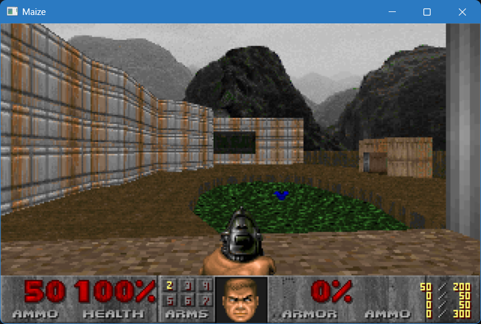

# The Maize Virtual Machine

This project implements a 64-bit virtual machine called "Maize." It began as
[Tortilla](https://github.com/paulmooreparks/Tortilla), an x86 emulator I wrote in C# and
later rebuilt as a virtual CPU of my own design.

Maize is on its second instruction set architecture. **Maize v2** is a clean break from the
first: thirty-two full-width general registers, no condition-flag register, and a
byte-granular, variable-length encoding built for software decode and for translation to a
host processor. The specification under `docs/spec-v2/` is the authority for what the
machine does, and the C++ virtual machine in this repository is one implementation of it;
somebody can build a second from that specification alone. **Maize v1**, the
sixteen-register CISC machine this project
shipped first, is frozen and preserved on the `v1` branch. See "Maize v1" below for what it
built and where to find it.

## Where v2 stands today

The v2 specification is ratified and frozen at base `2.0` (`docs/spec-v2/README.md`), and it
covers the whole machine: the register model, the instruction encoding, memory and
execution, every base instruction including floating point, the trap model, privilege
levels, Sv48 paging, boot, the calling convention, and the device surface.

The implementation is still catching up to that specification.

- `mzvm`, the virtual machine, and `mzasm`, the assembler, both build today and install with
  `scripts\install-mzasm.ps1` (or by pressing Ctrl+Shift+B in VS Code). `mzvmg` also builds,
  as the graphical VM binary, but has no display device wired to it yet.
- The machine executes the full base instruction set. Privilege levels and the CSR space,
  the trap model, Sv48 address translation, and external interrupts with the timer all
  landed on `dev` and are pending the operator's acceptance.
- `mzvm`'s command line is still small: `--registers`, `--memory`, `--load-at`, `--start`,
  `--max-steps`, and `--help`. None of v1's guest-integration layer has been rebuilt for v2
  yet, meaning the sandbox root, host-directory mounts, environment plumbing, and the
  `~/.maize/config` file.

What is still queued: a linker, a disassembler, a C compiler, an operating system, and a
conformance suite, sequenced in [ROADMAP.md](ROADMAP.md). Those first three tools already
have their v2 names reserved by decision (`docs/design/maize2-decisions.md`, D-1 under
maize-422): today's builds of `mzld`, `mzdis`, and `mzcc` still target v1, and each one
retires from that role as its own v2 port lands.

## The Maize v2 ISA Reference

**[The Maize v2 specification](docs/spec-v2/README.md)** is the normative instruction set,
twenty chapters plus two appendices and a glossary. It states a defined outcome for every
input, including every invalid one, and it is written so a reader who has never seen the
C++ source can build a conforming machine from the prose alone. It is not duplicated
here, because a single frozen source of truth beats two that drift apart.

Start at `docs/spec-v2/README.md` for the authority chain and the reading routes, or go
straight to `docs/spec-v2/terminology.md` if you already know what you are looking for. Read
that chapter even if you skip everything else. v2's size vocabulary is literal: a word is 64
bits, a half-word is 32, a quarter-word is 16, and a byte is 8. That breaks with both the
Intel convention and the RISC-V/ARM convention, and a reader carrying either one into the
later chapters will misread them.

## Hello, World!

Here is [`asm/v2/hello.mzasm`](asm/v2/hello.mzasm), the first program a person can watch run
on Maize v2. It writes a greeting one byte at a time to the console's data port and then
halts, using no CSR, stack, call, trap, or paging along the way.

    include "devices.mzasm"

    origin $1000

    start:
        pc_add message r2               ; the greeting's address, computed position-independently
        move.zb console_data r3         ; the port number, which fits in eight bits

    emit_byte:
        load.zb @r2 r4                  ; the next character
        branch_eq r4 r0 done            ; r0 supplies the zero the terminator is compared against
        port_out r4 r3                  ; the low byte of r4 leaves the console
        add r2 #1 r2
        jump emit_byte

    done:
        halt

    message:
        data_string_zero "hello, maize\n"

Assemble and run it from the repo root, once `mzasm` and `mzvm` are on your PATH:

    mzasm asm/v2/hello.mzasm
    mzvm asm/v2/hello.mzi

It prints `hello, maize`. The assembly language itself, its directives and its grammar, is
documented in `docs/spec-v2/assembler.md`.

## What It Is, Basically

* A 64-bit virtual machine implemented in C++ that executes v2's byte code
* An assembly language that represents that byte code, and an assembler, `mzasm`, that
  turns it into a loadable image
* A specification, `docs/spec-v2/`, precise enough that a second implementation can be
  built and checked against it independently
* An execution environment implemented in C++ that runs on Windows and Linux today and
  could be ported to other platforms

## Building From Source

Maize builds with CMake + Ninja and either Clang or GCC. On Windows, the primary compiler is
a pinned llvm-mingw toolchain fetched by a small bootstrap script, no installer or admin
rights required.

### Prerequisites (all platforms)

* CMake 3.21 or newer
* Ninja

Windows: `winget install Kitware.CMake` and `winget install Ninja-build.Ninja` (both
install per-user, no admin required). Linux: `sudo apt install cmake ninja-build`.
macOS: `brew install cmake ninja`.

### Windows, primary path: llvm-mingw

    scripts\bootstrap-toolchain.ps1
    scripts\install-mzasm.ps1

`install-mzasm.ps1` configures the CMake preset, builds `mzvm`, `mzvmg`, and `mzasm`, and
copies each into an install directory (`~\bin` by default), adding it to your user PATH if
it isn't there already. It is also what the VS Code default build task (Ctrl+Shift+B) runs,
so a fresh clone opened in VS Code and built once has all three tools on PATH.

The bootstrap script downloads a pinned llvm-mingw release into
`%LOCALAPPDATA%\Maize\toolchains\llvm-mingw\<pinned-version>\` and verifies it against a
pinned SHA256 checksum. Nothing is written inside the repository, and re-running it is a
no-op once the pinned version is already present. Set `MAIZE_TOOLCHAIN_ROOT` to install
and resolve somewhere else instead; the version and checksum are pinned in
`scripts\toolchain-pins\llvm-mingw.pin`.

### Windows, fallback: MSYS2 UCRT64 GCC

Install MSYS2 (msys2.org) to its default location (C:\msys64), then from an MSYS2
UCRT64 shell:

    pacman -S mingw-w64-ucrt-x86_64-toolchain

From a regular Windows shell (PowerShell or Git Bash):

    cmake --preset windows-msys2-debug
    cmake --build --preset windows-msys2-debug

If MSYS2 is installed somewhere other than C:\msys64, override the compiler paths in a
local, gitignored CMakeUserPresets.json.

### Linux

    cmake --preset linux-debug
    cmake --build --preset linux-debug

Uses whichever of GCC or Clang CMake finds by default; set CC/CXX before configuring to
force a specific compiler.

### macOS

    cmake --preset macos-debug
    cmake --build --preset macos-debug

Uses the system Clang from the Xcode Command Line Tools (xcode-select --install).

### A note on build type

Each platform has both a `-debug` and a `-release` preset (for example
`windows-llvm-mingw-debug` and `windows-llvm-mingw-release`). Use a release preset for
anything where speed matters. Every preset's build directory lives under
`build/<preset-name>/`.

### Running the test suite

    ctest --test-dir build/<preset-name>

That command registers one CTest entry per fixture from `cmake/MaizeV2Fixtures.cmake`,
covering the v2 interpreter and the mzasm assembler, all under the `v2` label. This is the
whole suite this branch registers; v1's own guest-toolchain suite runs only on the `v1`
branch, where v1's CMake targets still exist.

`scripts/run-tests.ps1` and `scripts/run-tests.sh` still build and drive `maize.exe`, a v1
binary this branch no longer builds, and are stale as a result; `ctest` above is the current
answer until they are repointed or retired.

### Editor setup (VS Code)

Open the repo in VS Code, install the recommended extensions when prompted (CMake Tools
and clangd), pick a configure preset from the CMake Tools status bar, and build.
Everything above also works from any editor or a bare terminal; presets are the only
interface CMake Tools uses.

The workspace also carries a Maize assembly extension at
[editors/vscode](editors/vscode). Its `.mazm` support targets v1's assembler; `.mzasm` files
have no language server of their own yet, and the `Assemble current .mzasm` and `Check
current .mzasm` tasks run `mzasm` directly with a problem matcher in its place.

## Maize v1

Maize v1 is the machine this project shipped first: a sixteen-register CISC design in the
x86 flags lineage, fully specified, with a complete toolchain (`mazm`, `mzld`, `mzdis`,
`mzcc`) and its own operating system, quesOS, running a borrowed Unix userland (the
[oksh](https://github.com/ibara/oksh) shell and the
[sbase](https://core.suckless.org/sbase/) coreutils) and playing DOOM at around 75fps once a
tier-up JIT, landed on v1 before the move to v2, compiled its byte code to native host code.

All of that is real, and it still builds, installs, and passes its own test suite. None of
it runs on this branch. v1 received no further development after the operator's ruling on
2026-08-12, and it is preserved, frozen, on the `v1` branch, with its own README and its own
specification under `docs/spec/`. Check it out with `git checkout v1` (or `git worktree add
../maize-v1 v1` to keep both trees around) to build or read it.

## Yeah, but... WHY?

It's a long story.

In 2016 I had a contract working on an ARM system, and I wasn't too familiar with ARM assembly. I had an idea to write an ARM
emulator, since I've always believed that the best way to understand a system is to try to build one. After getting stuck with the
ARM emulator, I decided to first build an x86 emulator and then go back to ARM. While I knew x86 assembly well enough to debug it,
I wasn't really an expert at it, and I didn't know the lowest levels of machine language. I thought that tackling an ISA I knew
would help me get the basics sorted out, and I'd come back to ARM later.

I got the x86 emulator working well enough to run code generated by standard compilers, but by then I wasn't working on ARM anymore, and I
was more interested in learning about how CPUs work. I also found
[Ben Eater's Youtube! channel](https://www.youtube.com/@BenEater/playlists), where he builds an 8-bit computer from scratch, and I decided
to use those as guidance for building a virtual CPU of my own design. The first implementation of that was the
[Tortilla](https://github.com/paulmooreparks/Tortilla) project.

With Tortilla, I wrote code for every single cycle of each instruction, as if the CPU were moving data around the buses like a physical CPU. That
was fun and enlightening, but it was also terribly inefficient. I decided to rewrite the entire thing in C++ and make the virtual machine more of a
byte-code execution environment rather than a simulation of a CPU, and that became the Maize project. The idea is to be able to compile any language
to Maize byte code and run it on any system that can run the Maize VM.

No, I never got back around to the ARM emulator, and at this point I doubt I will.

## Uses for Maize

Maize began mainly as a toy to learn about a few concepts:

* How byte-code virtual machines work
* The construction of an assembly language and corresponding assemblers and disassemblers
* Porting compiler back-ends to a new architecture
* How to write an operating system for a new architecture
* How systems integrate with hardware

It's been really useful for all of the above, and several of them stopped being learning
exercises and became shipped artifacts on v1. What I'm most excited about now is the same
promise carried forward on v2: compiling any language to Maize byte code and running it
anywhere that can run the Maize VM.

## License

Maize is licensed under the Apache License, Version 2.0. See [LICENSE](LICENSE) for the full text.
